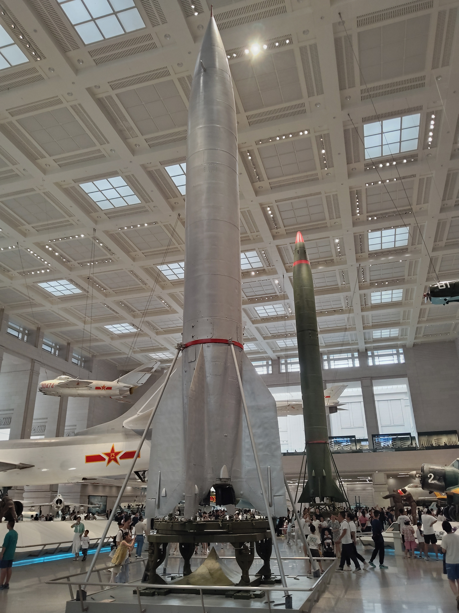
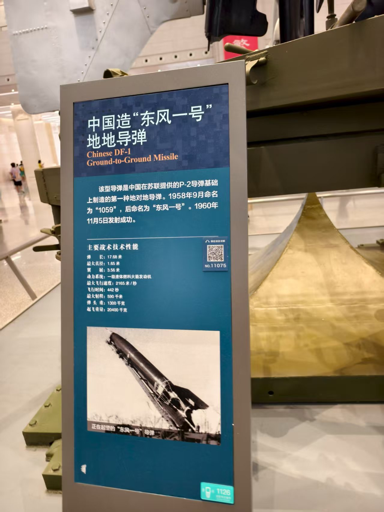
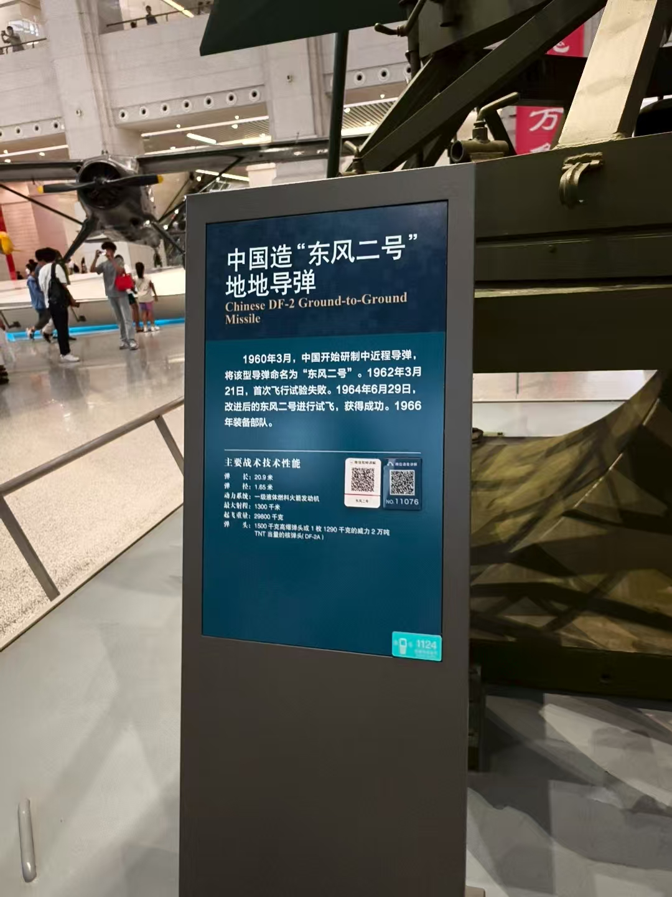

# 中国造东风地地导弹

## 中国造东风一号地地导弹

该型导弹是中国在苏联提供的R-2导弹基础上制造的第一种地对地导弹。1958年9月命名为“1059”，后命名为“东风一号”。1960年11月5日发射成功。

主要战术技术技能：

- 弹长：17.68米
- 最大直径：1.65米
- 翼展：3.56米
- 动力系统：一级液体燃料火箭发动机
- 最大飞行速度：2165米/秒
- 飞行时间：442秒
- 最大射程：590千米
- 弹头重：1300千克
- 起飞重量：20400千克

## 中国造东风二号地地导弹

1960年3月，中国开始研制中近程导弹，将该型导弹命名为“东风二号”。1962年3月21日，首次飞行试验失败。1964年6月29日，改进后的东风二号进行试飞，获得成功。1966年装备部队。

主要战术技术技能：

- 弹长：20.9米
- 弹径：1.65米
- 动力系统：一级液体燃料火箭发动机
- 最大射程：1300千米
- 起飞重量：29800千克
- 弹头：1500千克高爆弹头或1枚1290千克的威力2万吨TNT当量的核弹头（DF-2A）

不是东风压倒西风，就是西风压倒东风，中国独立自主的路并不好走。美国和苏联相继的核威胁，如同乌云般笼罩着新生的共和国，发展导弹刻不容缓。东风一号和东风二号的成功发射，犹如璀璨的明星，照亮了中国导弹事业前进的道路。

## 国防部五院

1955年初，中央决定研制原子弹，接着又决定发展导弹。国务院、中央军委，成立了以国务院副总理聂荣臻为主任的国防部航空工业委员会。1956年10月8日，国防部第五研究院（简称五院）成立，由从美国归来的火箭专家钱学森任院长，专门研究导弹。

五院汇聚了来自全国各地的技术骨干和优秀大学毕业生。钱学森亲自撰写《导弹概论》，成为中国首本导弹教材，为五院的技术人员提供了全面的导弹知识。

后来，中央军委进一步明确“两弹为主，导弹第一”的方针，把导弹摆在重中之重的位置。由于工业基础薄弱，聂荣臻提出“自力更生为主，力争外援和利用资本主义国家已有的科学成果”的导弹研究策略，得到了毛泽东、周恩来的认可。

1956年底，苏联向中国提供两枚供教学用的P-1模型弹（P-1导弹是苏联仿制德国V-2导弹所生产的），一发是供教学用的解剖弹，一发是完整的可供拆装的导弹。通过拆装、测绘和反设计，五院的研制人员，初步掌握了导弹的基础知识，为后续研制工作，做了技术上的准备。

1957年12月，从苏联引进的两枚P-2导弹及一套地面设备，运抵北京云岗。P-2导弹是P-1导弹的改进型，但并非是苏联最先进的型号。聂荣臻说，苏联给的东西虽然不是先进的，但却是我们所没有的。仿制导弹总比我们从头摸索便捷的多，应当好好学习，并要求五院在1959年10月新中国成立10周年之际，完成对P-2导弹的仿制，因而这枚仿制导弹也被称为1059导弹。

1958年春，五院明确仿制P-2导弹的分工：一分院负责总体设计和弹体、发动机研制，二分院负责控制系统的研制。五院和解放军炮兵司令部等单位，联合组建了教导大队，是解放军导弹部队的雏形。教导大队进行导弹运输、测试、起竖、指挥、发射和实战操作等训练和演习。

正当仿制工作进入关键阶段，中苏关系恶化，苏联撕毁协定，撤走全部专家，同时带走了重要的图纸资料。党中央和毛泽东决定自力更生发展尖端技术。毛泽东在北戴河会议上说：“要下决心，搞尖端技术。赫鲁晓夫不给我们尖端技术，极好！如果给了，这个账是很难还的。” 聂荣臻指示五院：“一定要争口气，依靠我们自己的专家，自力更生，立足国内，仿制P-2导弹决不能动摇，无论如何要搞出来。”

## 东风压倒西风

1957年11月，毛主席在苏联接见中国留学生时说：“现在世界正在大变，不是东风压倒西风，就是西风压倒东风。我们说西风压不倒东风，东风一定压倒西风！”

毛主席巧妙地引用红楼梦中的话，用于评价世界形势，并做出了“东风一定压倒西风”的精妙论断。正是由于这个颇具浪漫主义色彩的论断，我国将1059中近程导弹命名为东风导弹。

## 东风一号

东风一号的研制过程中，推进剂问题一度成为巨大的挑战。外国专家断言，中国不可能生产出达标的液氧和酒精。总设计师梁守槃（pán）并没有被这一断言吓倒，凭借着深厚的专业知识和严谨的科学态度，反复论证国产推进剂的可行性。在无数次的实验和分析中，不断探索液氧和酒精的最佳配比以及使用方法。最终，成功地证明了国产推进剂完全可以满足东风一号导弹的发射需求，为我国导弹事业的发展迈出了坚实的一步。

当时，我国在导弹研制方面还处于起步阶段，缺少关键的发动机试车台及试车规程方面的资料，给研制工作带来了极大的困难。发动机总设计师任新民带领团队，勇敢地迎接挑战。不畏艰难，自行编制任务书。查阅了大量国内外文献，结合实际情况，进行深入分析和研究。经过无数个日夜的努力，终于成功编制出符合我国实际情况的试车台设计任务书，为东风一号导弹的发动机试车提供了重要的指导。

全国有一千多家单位，参与了导弹部件的生产，涉及航空、电子、兵器、冶金、建材、轻工、纺织等多个领域。庞大的协作网络中，主要承制厂就有 60 多家。各单位紧密合作，充分发挥各自的优势。他们克服了重重困难，按时完成了各自承担的任务。

1960年11月4日，聂荣臻亲自抵达酒泉发射基地，他抚摸着导弹的墨绿色弹体，叮嘱道：“这是一枚争气弹，一定要打好！”

5日清晨，聂荣臻在张爱萍、钱学森等人的陪同下，来到指挥所。9时整，随着一声巨响，大地颤抖起来。10分钟后，导弹准确地命中550千米外的预定目标区。

当晚，在简陋的基地食堂举行庆功宴，聂荣臻激动地说：“今天，在祖国的地平线上，成功飞起了我国自己制造的第一枚导弹，这是我军装备史上一个重要的转折点！”

## 东风二号

在1059导弹仿制工作进行时，聂荣臻就指示五院要突破仿制到自行研制这一关，并迅速地发展提高，建立高水平的导弹技术体系，设计和制造出我国自己的导弹。在东风一号导弹首次飞行试验成功的庆祝宴会上，聂荣臻再次强调：1059发射成功，标志着仿制阶段将要结束，开始转到自行研制阶段。

1960年3月，五院一分院就组织了，自行研制导弹的方案制定与论证工作。从仿制到自行研制是一个质的飞跃，东风二号研制团队迎难而上，很快完成了初步设计。1961年春，设计图纸陆续下达试制厂，研制团队攻克了各个技术难关。不到1年时间，弹体、发动机和控制系统，都相继生产出来，并完成了有关试验。

1962年3月4日深夜，导弹专列在极其秘密的情况下，前往酒泉导弹发射场进行首飞试验。3月8日，专列抵达试验基地。3月11日，导弹移交给发射部队。3月20日，部队完成了试射前的一切准备工作。3月21日，我国自行研制的第一枚东风二号导弹进行首次飞行试验。

起飞后几秒钟，导弹出现了摆动和滚动，并明显地偏离射面。18秒时，发动机起火，随即关机。69秒时，导弹在离发射塔680米处坠毁。数十吨液氧、酒精燃起大火，冒起的烟尘，形成像核爆炸一样的蘑菇云。地面被炸出一个深6米，直径22.6米的大弹坑。现场人员惊呆了，不少人流下了痛心的眼泪，甚至号啕大哭。

面对首发失败，钱学森传达了聂荣臻的慰问和鼓励：“不要追查责任，但要总结经验教训。既然是试验，就有失败的可能。吃一堑，长一智。通过总结经验教训，以利再战。”4月9日，聂荣臻在国防科委办公会上又指出：“东风二号试射未达到目的，不要泄气，这不是什么意外的事。作为试验工作，这是正常现象。”

1962年5月至6月，召开了9次故障分析会议，最终从两个方面找到了失败的原因：

一、在导弹总体设计中，没有考虑到细长弹体在飞行中的弹性问题，弹体在飞行中的弹性振动与导弹姿态控制系统发生耦合，导致导弹飞行失稳。

二、弹体与发动机的结构强度存在薄弱环节，导致弹体与发动机结构损坏而起火。

这次失败，提高了研制人员对导弹研制规律的认识，总结出了对中国航天后来发展起了关键性作用的三条经验：

一、系统把握。控制好，弹体好，两个组合在一起还不一定就好，必须从系统角度考虑匹配问题。

二、地面试验。导弹上天了，就毫无办法。必须在地面做好充分试验，包括仿真试验、模拟试验、综合试验，等等。在地面上做完充分试验后，再做发射试验。

三、预先研究。研制一个型号前，应有充分的预研究，先在这个基础上，再去研制一个型号。

1964年6月29日，经过改进的东风二号导弹，再次进行发射试验，取得圆满成功。证明改进后的设计方案是正确的，生产质量和发射操作是优良的。7月9日和11日，又连续发射两发东风二号导弹，都获得成功。

从此，中国导弹科技队伍，初步掌握了自行研制弹道导弹的技能，坚实地迈出了独立设计、研制的第一步。