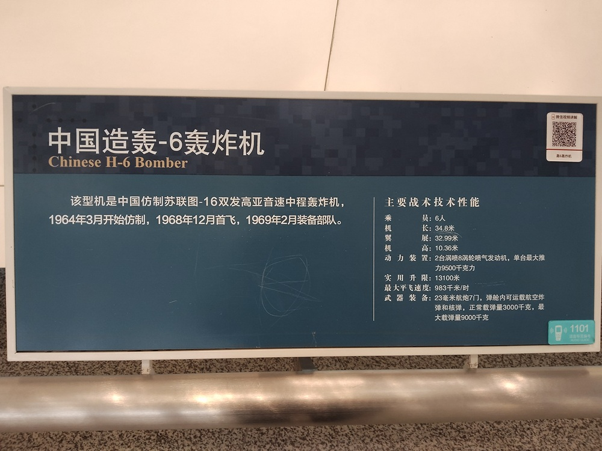

# 中国造轰-6轰炸机

该型机是中国仿制苏联图-16双发高亚音速中程轰炸机，1964年3月开始仿制，1968年12月首发，1969年2月装备部队。

主要战术技术性能：

- 乘员：6人
- 机长：34.8米
- 翼展：32.99米
- 机高：10.36米
- 动力装置：2台涡扇8涡轮喷气发动机，单台最大推力9500千克力
- 实用升限：13100米
- 最大平飞速度：983千米/时
- 武器装备：23毫米航炮7门，弹仓内可运载航空炸弹和核弹，正常载弹量3000千克，最大载弹量9000千克

编号为20210的轰炸机，是轰-6甲轰炸机，陈列在军博一层展厅一进大门的位置。轰-6甲轰炸机，自带威严，自带气场，自己就能说明自己举足轻重的重要地位。2024年国防部中外媒体新春招待会，就是在轰-6甲轰炸机前举行的。让整个招待会充满了战斗氛围，发出了中国军队的强音。

轰-6甲轰炸机，到底是个什么来头？

## 基本信息

轰-6轰炸机（以下简称轰-6）是在20世纪60年代初，中国参照苏联的图16轰炸机自行研制、生产的战略轰炸机，是我空军服役时间最长的机种之一。六十多年过去了，轰-6在不断的改进、生产，型号可以说是不计其数。有网友调侃说，再过几年英文字母都不够六爷用的了。但是，轰-6甲这个型号只有两架。中国第一颗氢弹，就是由展厅中的这型轰-6甲运载到空中进行投弹实验的。

轰-6的机长34.8米，翼展32.99米，机高10.36米，采用悬臂式中单翼，双梁盒式结构。

轰-6是双发高亚音速中程轰炸机，发动机舱位于机身的两侧，采用涡喷8发动机，巡航速度0.75马赫。巡航高度9000米，实用升限13100米。从北京到上海的直线距离，是1000多千米。轰-6的最大航程为5760千米，可以在北京和上海之间打3个来回不到。

轰-6的机组乘员6名，设有两名驾驶员、两名领航员、一名通讯员和一名尾部机枪手。自卫武器系统由7门23毫米航炮组成，其中1门位于机头处，2门位于机尾处，其余4门位于机背。弹仓内可运载多种航空炸弹和核弹，正常载弹量3000千克，最大载弹量9000千克。

## 轰-6的改型

轰-6看似老旧的机型，却通过不断技术改进，衍生了多个版本。网友们调侃说，六爷除了名字和气动外形没有什么变，其他的都变了。

刚开始，受限于落后的航空工业，我国研发出的三个改型（轰-6甲、轰-6乙、轰-6丙），与原始轰-6相比，没什么太大的区别。轰-6甲主要是在弹舱内部，增加了恒温空调设备以及检测设备等，用于我国第一颗氢弹的空中投弹实验。这三个改型的数量都不多，并且有一部分在经过特定试验后，又被拆掉了改造部分，作为原始轰-6返回部队继续服役。

后来，随着中国航空工业的发展，我国开始较大幅度的改进轰-6，不断对动力、航电及机载武器进行改进，并发展出多种特种平台。在不断的改进发展过程中，我国也逐渐建成了轰炸机数量总和超过美俄的全球最庞大的轰炸机梯队。

之所以能在数量上领跑，除了生产体系的多年累积，还离不开其成本相对较低、维护相对便捷的优势。

## 发展大规模轰炸机梯队的原因

我国发展大规模轰炸机梯队的原因，总结起来主要有三点。

首先，我国需要保持自身战略核威慑能力。其次，我国需要一个庞大的轰炸机梯队，去应对外部威胁。因为我国面临着复杂严峻的地缘压力，要求我国必须拥有足够强大的空中打击能力。最后，我国需要维持一条高效且稳定的轰炸机生产线。

值得一提的是，从中国开始研制轰20以后，就有不少人开始讨论，是否还需要继续生产轰-6？

现在，美国急需要全新的轰炸机替换现役的严重老化的轰炸机，开启B21生产线很花钱，而重启已经关闭的B2生产线更花钱。

美国人的教训提醒我们，必须继续生产轰-6，让中国保持拥有一条高效且稳定的轰炸机生产线。若是未来爆发战争，中国就可以全速运转这条生产线，保障前线的装备需求。

轰-6主要担任战术战略轰炸、侦察、反舰、巡逻监视等多种任务，是我国空军战略轰炸力量的核心。自服役以来屡建战功，多次西出太平洋进行远海训练，使我国空军的作战能力得到了有力的提升。