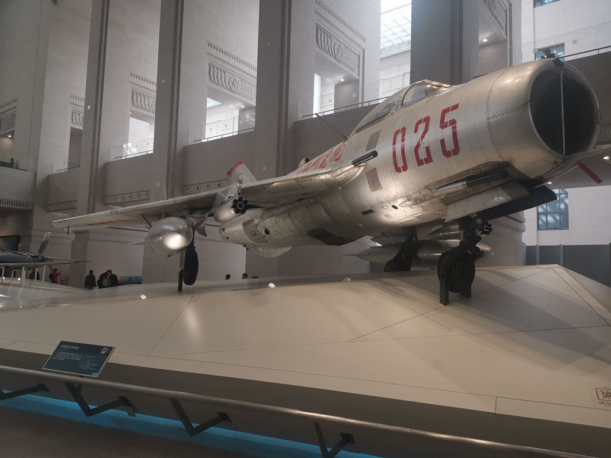

# 中国造歼-6歼击机

该型机是中国仿制苏联米格-19超音速喷气式战斗机，1961年12月开始仿制，1963年9月首飞，12月定型，1964年装备部队，多次改进改型，形成歼-6飞机系列。主要用于争夺制空权和国土防空，也可用于对地攻击。

主要战术技术性能：

- 乘员：1人
- 机长：12.54米（不含探空管）
- 翼展：9.04米
- 机高：3.89米
- 动力装置：2台涡喷6涡轮喷气发动机，单台最大推力2600千克力，单台加力推力3250千克力
- 实用升限：17500至17900米
- 最大平飞速度：1450千米/时（高度9000米）
- 武器装备：30毫米航炮3门，火箭弹发射器2组或航空炸弹2枚

歼-6是我国第一种超音速歼击机，曾是空军和海军航空兵装备数量最多、服役时间最久、战果最辉煌的国产第一代喷气式歼击机。在各次实战中，歼-6共击落20多架各型飞机，而自己没有一架被击落。2010年6月12日，正式退出空军装备序列。

## 歼-6歼击机

歼-6，体型小，重量轻，机动性好，适于近距离空战格斗，主要用于争夺制空权和国土防空，也可用于对地攻击。

歼-6，是我国仿制苏联米格-19的超音速喷气式歼击机。1961年12月开始仿制，1963年9月首飞，12月定型，1964年装备部队。多次改进改型，形成歼-6飞机系列。到1983年停产，共生产了5205架。

歼-6乘员1人，机长12.54米，翼展9.04米，机高3.89米，最大平飞速度1450千米/小时，实用升限17900米，最大航程2200千米，装备30毫米航炮3门，机翼下挂架可挂火箭弹发射器2组或航空炸弹2枚。

总体布局特点是，头部进气，大后掠中单翼，低平尾，单垂尾加单腹鳍（歼教-6为双腹鳍），单座双发。歼-6布局是由米格-17发展而来，从米格-15到米格-17，再到米格-19，其总体布局其实是一脉相承的。米格-15的布局为早期喷气式歼击机的经典布局之一，其布局比较合理且成熟。

歼-5的涡喷-5发动机，是离心式涡轮喷气发动机。歼-6的涡喷-6发动机，是轴流式发动机。空气直接从一级风扇吸入，沿着轴方向流动。流动更加流畅，燃烧效能大幅提升。发动机工作原理的变化，是歼-6性能远超歼-5的奥秘所在。

为了使机身承受超音速飞行时的强度，歼-6采用桁（héng）条式机身结构。机身内的桁条和隔框组成飞机的骨架，而外部的蒙皮，承受的是通过桁条与隔框传递过来的二维方向的力。每个格子的范围内，铝合金蒙皮就像一张纸。同样的材料，虽然撕开很容易，但平面拉扯时却需要费很大的力。

蒙皮作为飞机的外壳，也需要承受一定的力，所以桁条式机身结构也称为半硬壳式结构。桁条式机身的优点是载荷分散传递，通俗地讲就是飞机各个部分受力较均匀，所以能够通过重量更轻的材料，承受更大的载荷。

## 战功卓著

中国空军、海航飞行员驾驶歼-6歼击机，多次击落飞行高度超过歼-6静升限的美军高空无人侦察机，并击落击伤性能远在歼-6之上的F-104、F-4B、F-4C等先进战机的成果。

1964年11月15日11时53分，中国雷达报告，在海南岛陵水以东170公里处，发现美国BQM-147G型无人侦察机1架，航向西北，高度1.76万米，时速780公里。5分钟后，空1师驻遂溪机场作战分队中队长徐开通，奉命驾驶歼-6飞机起飞拦截。12时20分，歼-6爬高到1.62万米。吸取第一次飞行员仰射攻击失利的教训，徐开通不慌不忙，按照反复练习的跃升动作，2分钟后冲高至1.75万米，距目标1500米。这时与美国无人机基本处于同一高度上，理想的射击条件已经形成。徐开通放下减速板，从目标后下方5度角进入攻击位置。距离400米时，徐开通两次齐射。距离230米时，又是一个三炮齐发，无人机一头栽下。此战，创造了歼击机在平流层击落敌机的记录，也为此后中国空军歼击航空兵部队一连串的胜利提供了借鉴。

20世纪60年代初，国民党空军启用有“西方战略眼睛”之称的RF101超音速侦察机。歼-6装备中国空军后，重要任务之一就是应对台湾RF101的侦查活动。

1964年12月18日，国民党空军少校飞行员谢翔鹤，驾驶着RF-101侦察机，大摇大摆地进入浙江上空实施照相侦察。就在他刚进入浙江上空的时候，解放军海军航空兵4师10团副团长王鸿喜，驾驶歼-6起飞迎击。谢翔鹤有所察觉时为时已晚，在9700米高空，王鸿喜利用3门航炮，瞄准RF-101猛烈开炮，将其击落于浙江温岭以东海面，谢翔鹤跳伞被俘。

1965年3月18日，国民党空军派出2架RF-101执行例行侦察任务，空军航空兵第18师立即指挥54大队副大队长高长吉驾驶歼-6起飞迎战。在击落RF-101的整个过程中，从接敌到击落敌机，都是在超音速条件下进行的。高长吉在3分40秒中，连续做了16个高难度动作。从11000米高空追到2000米，从600米距离打到480米，一次射击解决战斗。这是中国空军航空兵，首次在超音速飞机的极限速度下，作战并取得战果，世界空战史上，超音速条件下击落敌机的纪录就此诞生。

1965年9月20日，一架美国空军F-104C歼击机接近中国海南岛西部领海。中国海航飞行员高翔、黄凤生，驾驶歼-6，双机起飞迎敌。F-104C是全天候多用途高速歼击机，作为第二代超声速歼击机，各项性能都优于歼6歼击机。美机由西向东，横穿中国雷州半岛，高翔、黄凤生的歼6双机，在地面雷达指挥下，占据有利位置隐蔽接敌。利用敌机转弯的时机，切半径进入射击位置。高翔在接近到291米的近距离时开炮射击，一直打到39米时才脱离。由于距离太近，敌机爆炸的碎片打伤了高翔战机的发动机，造成右发停车。F-104C的飞行员，跳伞后被我俘获。

这一战例创造了多项纪录：

- 用第一代超声速歼击机击落第二代超声速歼击机。
- 首次在空战中击落F-104C歼击机。
- 39米的世界空战史上最近交火距离。
- 首次在中国领空击落美机并俘获美国飞行员。

## 仿制米格-19

1954年1月，米格-19歼击机原型机试飞成功。米格-19是苏联首款具有实用价值的超音速歼击机，但苏联航空界当时并不看好米格-19的前景。就连总设计师米高扬，也都是抱着一种交差的态度。

米格-19在苏联量产后不久，就被性能更先进的米格-21取代。根据苏联航空装备研制一代、装备一代、外贸一代的思路，三代机的设计思路刚刚出现，二代机米格-21顺利投产，作为一代机的米格-19技术，就被整体打包或拆分，向各国售卖。

当时我国国土防空作战的需求，主要是对付东南沿海地区的侦察机。

在当时的技术背景下，截击轰炸机与截击侦察机，作战方式并不一样。截击轰炸机一般要迎面攻击，绝不能让对方飞到目标区域。而截击侦察机如果迎面攻击，则可能逼迫对手返航，让对手另择时机再来。所以在防御侦察机时，可以先放任侦察机飞抵目标区域，随后利用其油料不多、航线难以改变的特点，在返航路上予以歼灭。只要不让对方把情报带回去，防御就是成功的。

这就要求歼击机不仅能够迎敌，还要善于追击。对歼击机的飞行速度提出了更高要求，米格-19正是一款符合我国实战需求的歼击机。

为了在国际共产主义运动中，获取更多的支持，时任苏联国家领导人赫鲁晓夫，在向中国转让军事技术方面，作了重大让步。1957年10月中苏两国签定协议，由苏联向中国出售米格-19飞机的制造技术，并提供全套技术资料、样机和部分散装件、成品附件。由于米格-19的发展已结束，中国可以得到比较成熟且成系列的产品。

苏联当时开出的备选清单上包括了米格-19S（昼间战斗型）、米格-19P（全天候截击机/航炮型）和米格-19PM（全天候导弹截击机）。米格-19家族3个主要型号搭配使用，基本上可以满足空军昼间争夺制空权和夜间拦截的需要。按照协议，3个型号中国均有采购。

## 坎坷起步

仿制的米格-19P，在国内被称作东风103，是当时中国国内航空工业提出发展的一系列东风型号之一。1964年11月，航空工业部统一国产飞机命名，东风103改称歼-6甲。

歼-6甲型，是由沈阳飞机厂和南昌飞机厂，于1958年开始，同时仿照米格-19P型研制的。两厂全部采用自行编制的工艺资料和自己制造的工艺设备。1958年12月17日，东风103由王幽淮驾驶首飞成功。1959年4月26日，国家鉴定委员会正式鉴定验收。

歼-6甲的试制工作在大跃进时期进行，整个试制周期，比歼-5（米格-17F）大约缩短了一半。由于严重违背科学规律，出厂的飞机和发动机，陆续出现多起严重质量故障。飞机在制造中盲目更改工艺、材料，有些材料用错，有些材料选用了未经试验的代用品。飞机在飞行过程中，出现进气道铆钉脱落、座舱漏气、平尾抖动等问题，根本无法正常飞行，更谈不上作战使用。1959年12月12日，01架歼-6甲飞机在飞行中导管漏油，引起发动机失火。

1960年9月，由于缺乏配套备件，同时飞机上的钢材、镁合金件、焊接件相继发生质量问题，仿制工作和试生产都陷入停顿状态，连续3年没能继续交付飞机。

1973年11月，空军提出新的武器装备发展规划，其中一条是：为解决夜间作战的需要，建议重新恢复歼-6甲的生产。当时歼-5甲夜间歼击机（米格-17PF）已经陈旧不堪。1974年，贵州飞机厂根据空军要求，重新仿制歼-6甲，以便担负夜间作战任务。1975年12月21日，新歼-6甲首飞成功。1977年，该机设计定型，少量投产。

## 试飞歼-6

王昂，1958年从北京航空学院飞机制造专业毕业。经过严格选拔，成为我国第一批大学生飞行员。1966正式成为一名试飞员。

王昂驾驶歼-6飞机进行飞机性能试飞，做完半滚倒转、退出俯冲后，他拉起转入上升。飞机在加力上升过程中，突然产生了剧烈的纵向俯仰摆动和左右摇晃。在巨大的晃动中，座椅上固定人体的安全带都绷断了。王昂的身体被反复弹起，头部重重地与座舱盖反复撞击，额头流出的鲜血顺着脸颊往下流。随着摆动频率的加快，牙齿咬伤了自己的内腮，身体特别是头部剧烈的疼痛使他几乎昏迷过去。

作为一个优秀试飞员，他用仅存的一点意识牢牢抓住驾驶杆，进行着一系列的紧急处置。飞机仍在继续下沉，已经能看到尖顶。情况越来越紧急，只要启动弹射救生，在1、2秒内就可脱险。但是，这架歼6，凝结着几十万航空人很多年的希望，王昂并没有启动紧急弹射。

王昂迅速调整姿势，在飞机晃动的间隙，关闭了液压操纵的电门，改用电动操纵。改为电动操纵后，飞机反应迟钝，操纵更加困难。已经受伤的王昂，每一次操控动作，都要付出很大的努力。但是，飞机的摇摆俯仰停止了，他终于操纵着飞机飞回了机场。

当地面人员打开变形的座舱盖时，脸颊肿胀、眼睛渗血的王昂语气平静地说：查一下操纵。后经过地面人员检查，发现整个副翼全部撕裂，翼尖受损，飞机永久变形了。

王昂驾机安全着陆，不仅挽救了飞机，而且对改进歼6飞机的操纵系统提供了宝贵的资料。数日后，故障鉴定结果出来了：飞机力臂调节器故障。作为空军的主战飞机之一，无数飞行员操纵过歼6，那根看上去并不特别的飞机驾驶杆，是试飞员王昂冒着生命危险试飞出来的。

歼-6飞机让我们从完全仿制阶段，进入到改进设计的阶段，向着自主设计高性能歼击机的目标，迈进了一大步。