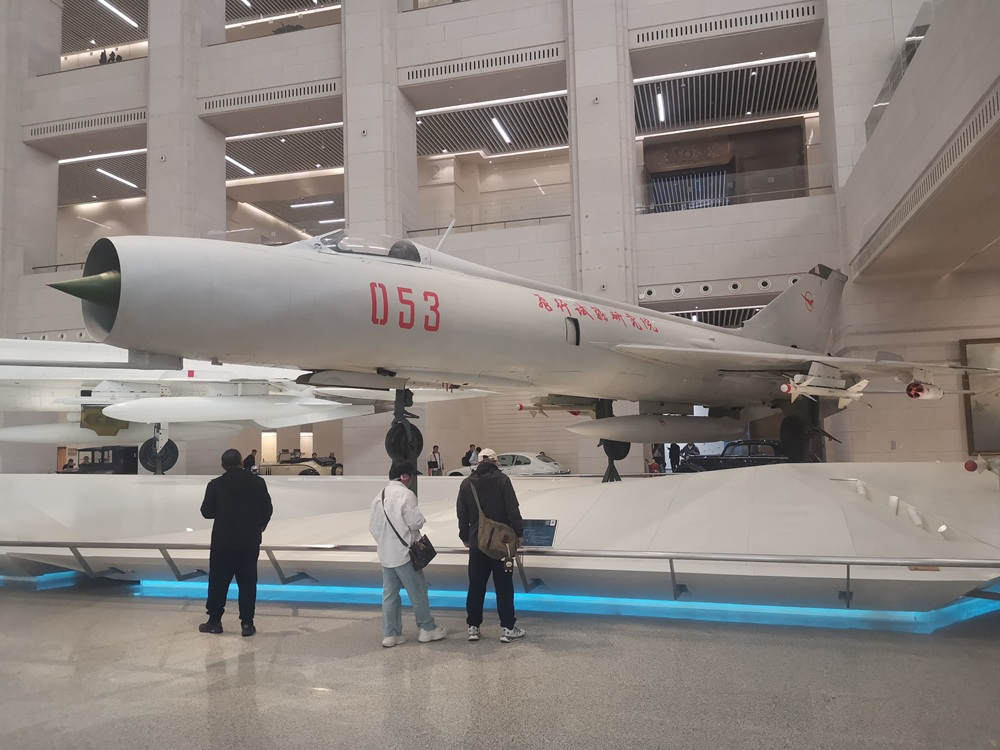

# 中国造歼-8歼击机

该型机是中国自行设计、研制的第一种歼击机，为单座、双发高速歼击机，1966年底开始研制，1969年7月首发，1980年12月装备部队。具有中距作战和近距格斗能力，主要用于空中格斗和夺取制空权，兼有一定的对地攻击能力。经多次改进，形成多品种、多用途的系列机型。

主要战术技术性能：

- 乘员：1人
- 机长：19.25米（不含空速管）
- 翼展：9.34米
- 机高：5.41米
- 动力装置：2台涡喷7甲涡轮喷气发动机，单台最大推力4400千克力，单台加力推力6000千克力
- 实用升限：20800米
- 最大平飞速度：2693千米/时（高度大于13600米）
- 武器装备：23毫米航炮2门，PL-2/2乙空空导弹2或4枚，火箭弹发射器2或4组

歼-8属于第二代歼击机，也被称为世界上最后一种第二代歼击机。1966年底开始研制，1969年7月首发，1980年12月装备部队，是我国自主设计、研制的第一种单座双发高空高速歼击机，一直活跃在与对手主力战机对抗的最前沿。

## 歼-8

歼-8具有中距作战和近距格斗能力，主要用于空中格斗和夺取制空权，兼有一定的对地攻击能力。经多次改进，形成多品种、多用途的系列机型。

在设计上，歼-8参考了苏制米格-21歼击机（歼-7），装备两台WP-7甲涡喷发动机，加长了机头，提高了高空战斗能力。乘员1人，机长（不含空速管）19.25米，翼展9.34米，机高5.41米。

歼-8不断演进，衍生出众多型号。显著的特征变化是进气方式，机头进气和两侧进气。

歼-8E是歼-8的改进型，1991年开始研制，1992年11月首飞，1993年定型。外形与歼-8基本相同，主要改进是使用平面显示器替代了瞄准具，机身上增加告警天线和应答装置。

歼-8II，也被称为歼-8B，是在80年代初期开始研发的新机型，对歼-8系列做了一次重大改进。改进的核心是，将原先的机头进气，转变为两侧进气。从而为机头腾出宝贵空间，以便安装208雷达，并支持发射国产的霹雳-4导弹，使得歼-8II具备了超视距作战能力。

81192撞机事件，发生于2001年4月1日。当天，美军一架EP-3型侦察机，在海南岛附近海域上空侦查飞行。海军航空兵派出2架歼-8II监视拦截，其中一架在海南岛东南70海里（110公里）的中国专属经济区上空，与美机发生碰撞。中国歼击机坠毁，飞行员王伟跳伞，下落不明，后确认死亡。

三十多年的服役中，歼-8不仅准备对抗ⅠDF、F-14、F-2和F-15等各型歼击机，就是面对猛禽F-22也要上去缠斗一番。在中国空军武器装备并不强大的年代，歼-8捍卫着中国的蓝天。

## 自主设计研制

1963年7月，沈阳飞机设计研究所的顾诵芬，提出了一款新型歼击机的设计报告。1964年5月，在新机改进改型方案会议上提出，要在米格-21的基础上，设计一种性能更好的歼击机，综合作战性能可以与国外同时期超音速歼击机相对抗。

1964年10月，新型歼击机开始方案论证。在论证会上，沈阳飞机设计研究所提出了飞机装单台发动机和双台发动机两种方案。前者是全新研制大推力发动机的方案，后者是采用成熟发动机（涡喷7甲）进行改型试制的方案。会议确定的双台发动机方案稳妥、可靠，有一定的技术基础，是歼-8飞机能够研制成功的前提。

歼-8的研制方案，突出高空、高速、增大航程、提高爬升率、加强火力等性能。针对歼-7飞机的缺点，逐项加以改进，各项性能指标均有提高：

1. 最大速度为2.2马赫。
2. 最大升限2万米以上。
3. 最大爬升率每秒200米。
4. 基本航程1500公里，最大航程2000公里。
5. 规定了在高度为1.9万米空中的作战时间。
6. 安装改进设计的航炮和空空导弹。
7. 安装搜索距离较大的雷达。

1965年5月17日，总参谋长罗瑞卿批准新型歼击机的战术技术指标和研制任务，同时也赋予这款歼击机一个新名字：歼-8。

1965年下半年，沈阳飞机厂开始进行歼-8飞机试制的准备工作。歼-8工艺方案，是在综合了苏联和英国的先进经验基础上制订出来的。后来的实践表明，歼-8工艺方案采用的新工艺协调方法，大大减少了工艺装备，加快了歼-8飞机的试制进度。全机11400多个零件，1200多项标准件，从100多个组合件直至前后机身对合，机身机翼对合，以及发动机、油箱在飞机上的安装，基本上都是一次成功。

## 歼-8白

1968年9月15日，歼-8型飞机02架进行了整机静力破坏试验。当加载到92%设计载荷时，中机身多处折断，试验结果不合格。面对挫折，广大技术人员没有气馁，继续攻关，到1968年12月加强了结构的薄弱部位，验证和澄清了各种技术问题。

由于交流供电系统和雷达系统的进度问题，原计划的全天候型蜕变成了只安装直流电和测距器的白天型。由于仅能在白天进行作战，因而被戏称为歼-8白。

歼-8白，作为歼-8系列的初代型号，在历经十年的设计与改进后，于1979年12月31日最终设计定型。在识别上，可以通过其独特的机头进气设计和相对较长的机身来进行判断。

歼-8白如今已经退役，成为中国航空历史的一部分。

## 试飞歼-8

1969年7月5日上午9时，试飞员王焕在沈阳进行了首次试飞，高度3000米，时速500公里，取得了圆满成功。此后，歼-8在西安继续试验，由鹿鸣东担任试飞员。在继续试飞中，飞机遭遇了跨音速抖振故障，很长时间不能超过音速。设计人员反复攻关，采取多种办法，终于在1977年彻底排除了跨音速抖振故障。

1978年6月3日，试飞员王昂驾驶歼-8，在17000米高空作加力边界试验。当左发动机加力到98%左右时，突然嘣的一声，两台发动机同时停车。王昂迅速把油门拉到停车位置，转向机场，并报告指挥员。一面观察飞机下滑情况，一面起动发动机。但是，在12000米的高空，连续3次起动发动机失败，飞机转眼就跌落到近3000米高度。

按出厂规定，3000米以下发动机起动不成功，就来不及跳伞了。王昂十分镇定，一面作进机场迫降准备，一面不放过最后起动发动机的机会。终于在第6次尝试时，发动机起动成功，飞机安全落地。王昂冒着生命危险挽救了飞机，取得了歼-8飞机无动力情况下，在高、中、低空中的准确下滑率。地勤人员也根据王昂提供的线索，找到了原因，消除了隐患。

还有一次，飞机在空中就冒烟了，指挥员大声地喊：跳伞！但是，王昂没有跳伞。飞机冒着黑黑的浓烟开始下降。飞机还在落地中，机尾的黑烟中就窜出了火焰，后机身在跑道上就被烧掉了。王昂及时采取应急刹车，飞机在最后一刻停在跑道尽头。王昂说：“我根本没想到跳伞。这架飞机是独生子，就这么一架，如果我跳伞了，就前功尽弃了。”

1979年12月31日，航空产品定型委员会同意歼-8型飞机设计定型。1980年3月2日，国家军工产品定型委员会批准定型。在1969年到1979年的十年试飞中，歼-8累计飞行1025个起落，共计663个飞行小时，解决了一系列技术问题。

歼-8的研制过程是引进、消化、再创新的过程，锻炼了技术队伍，积累了先进歼击机的设计经验，标志着中国航空工业从仿制走上了自行设计的道路。