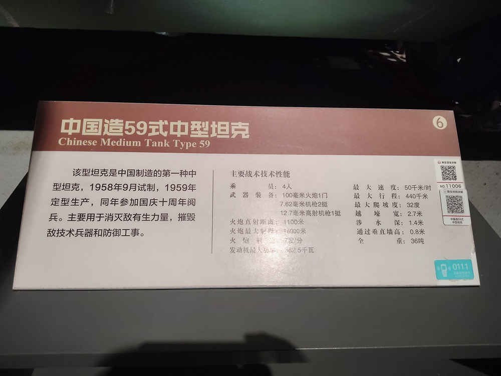

# 59式中型坦克

该型坦克是中国制造的第一种中型坦克，1958年9月试制，1959年定型生产，同年参加国庆十周年阅兵。主要用于消灭敌有生力量，摧毁敌技术兵器和防御工事。

主要战术技术性能：

- 乘员：4人
- 武器装备：100毫米火炮1门  7.62毫米机枪2挺  12.7毫米高射机枪1挺
- 火炮直射距离：1100米
- 火炮最大距离：16000米
- 火炮射速：7发/分
- 发动机最大功率：382.5千瓦
- 最大速度：50千米/时
- 最大行程：440千米
- 最大爬坡度：32度
- 越壕宽：2.7米
- 涉水深：1.4米
- 通过垂直墙高：0.8米
- 全重：36吨

59式中型坦克，是中国装备的国产第一代主战坦克，火力较强，装甲防护和机动性能良好，重量较轻，结构简单，工作可靠，使用维护方便。1959年开始列装，在1980年代以前一直都是中国装甲兵的主要装备，累计生产了1万辆以上。

## 59式中型坦克

59式中型坦克，由车体和炮塔两部分组成。车体由轧（zhá）制钢板焊接而成，驾驶舱在车体前方左侧，车体中段是战斗舱，其上有炮塔，车体后部为动力-传动舱，发动机横向布置。炮塔为铸造件，车内有4名乘员，驾驶员位于车内左前方，便于向前观察。车长位于火炮的左后侧，炮长位置在车长位置的前下方，装填手位置在火炮右侧。车体首部和侧面的装甲较厚，炮塔成流线型，具有良好的抗弹能力。

59式中型坦克的主要武器有，1门105毫米火炮，射速7发/分，2挺7.62毫米机枪，1挺12.7毫米高射机枪。

1万多辆的59式坦克，绝大部分是包头617厂生产的。洛阳拖拉机厂，是另一个坦克生产基地，生产了500辆59式坦克。

## 渐渐远去的历史

坦克作为陆军突击兵器，出现在一战，成名于二战，并确立了在陆军中的主导地位。

解放初期，新中国还没有自己的坦克工业，只有几个小型坦克修理厂。更重要的是工业基础十分弱，根本不具备研制和生产坦克的能力。建国初期，特别是朝鲜战争爆发后，从苏联购进了坦克装备，主要是T-34/85中型坦克。

1955年11月，中国从苏联获得了新型的T-54中型坦克及其改进型号T-54A的样车。T-54是当时世界上最先进的中型坦克之一。T-54的成功引进，使中国装甲兵的坦克装备技术水平首次与世界同步。

对T-54和T-54A的性能，中国比较满意。为了发展自己的坦克工业和培养技术人才，中国要求苏联提供T-54A中型坦克的全套图纸和生产工艺，决定以T-54A为基础进行仿制生产。在1956年4月，动工建设国内第一家坦克制造厂（内蒙古第一机械厂，代号：617厂，简称：包头一机厂）。

1958年底，第一辆用苏联零件组装的国产T-54A，开下了流水线。到1959年，617厂已经可以完全独立生产T-54A中型坦克。1959年10月1日，首批国产的32辆T-54A，参加了建国十周年大阅兵，这也是中国产坦克首次向公众亮相。1959年底，中国产T-54A被正式命名为1959年式中型坦克，简称59式坦克。59式中型坦克的问世，宣告了中国不能生产坦克的历史彻底终结。

20世纪60年初，由于中苏关系破裂，进口装甲材料来源中断，包头一机厂被迫停产。后来，中国自行研制了稀土601铸造装甲钢和车体603轧制厚装甲钢，从1963年开始恢复生产59式坦克。

整个六十年代，包头一机厂的59式坦克生产，显得坎坎坷坷。1965年之前的59式坦克质量和性能均不能令人满意，常出现新坦克交付部队后立即回厂修理的情况。到1971年，包头617厂仅生产了2300多辆59式坦克，年均产量仅为190辆。

从1970年代初期开始，由于工艺的成熟，坦克年产量开始上升，年产坦克在500辆左右。到70年代末期达到满负荷，1979年产量高达1000辆。1980年500辆，1981年600辆，1982年1200辆，1983年1500辆。至1985年停产时，中国共生产了1万辆以上的59式坦克。

59式中型坦克装备数量多、规模大，在中国装甲机械化部队的装备体系中占有重要地位。多年来中国运用现代新技术，对59式坦克进行了数次重大改进。

## 59-2式中型坦克

1979年，中越边境自卫还击作战后，针对59式中型坦克在作战中暴露出来的火控系统落后、防护能力弱等缺陷，中国决定对59式中型坦克进行第一轮改进。1984年，59式改进中型坦克，通过了定型试验并正式定型，命名为59-1式中型坦克。

59-2中型坦克是在59-1坦克和中国第二代主战坦克的研制同时，1980年开始对59-1坦克进一步改进设计。改进后的坦克，称为59-2式中型坦克。1984年59-2式中型坦克正式定型。

59-2式坦克的作战能力有了质的飞跃，形成了一种新的战斗坦克，接近当时的世界先进水平（如美国的M-60A2、德国的“豹”1、苏联的T-72等坦克）。

59-2式中型坦克的改进，除继续采用在59-1式中型坦克改进中获得成功的各项技术外，最大的亮点是采用了引进的当时具有国际先进水平的三项技术。

第一，59-2坦克安装了79式105毫米线膛坦克炮，是从国外引进的北约标准坦克炮，弹药为北约标准定装式弹药，弹药种类为105毫米尾翼稳定脱壳穿甲弹、破甲弹和碎甲弹。

第二，安装战斗室自动灭火抑爆装置。从国外引进的战斗室自动灭火抑爆装置，配有高灵敏度的光学探测器和微处理机系统，具有两次抑爆和四次灭火功能，能在10毫秒内自动探测出侵入车内的破甲弹高能射流并发出控制信号，启动灭火瓶在60毫秒内实现抑爆，从而防止了坦克中弹后的二次效应对车辆和乘员的伤害。

第三，配置VRC-8000型坦克电台，这是一种跳频、可加密多信道坦克战术通信电台，具有当时世界先进水平。具有通过跳频摆脱敌方电子干扰、对通信内容自动进行加密、并具有两千多个波道供选择和变换。

59-2式中型坦克的改进成功，使59式中型坦克真正提高了战斗性能。从技术上说，59-2坦克是第一种实装到部队并能与国外二代坦克在火力上相抗衡的坦克，是第一种通信能力与当时世界水平差距不大的中国坦克。

## 59D式中型坦克

到了20世纪90年代，世界战争形态开始由机械化战争向信息化战争转变，新军事革命不仅给军队体制编制、作战理论等诸多领域带来了巨大的冲击，也给军队信息化建设带来了机遇和挑战。美军数字化部队的出现，进一步激发了世界各国发展数字化坦克装甲车辆的兴趣。

1990年7月，解放军总部机关根据中国装备发展的需要，及时作出了运用现代新技术，对59式中型坦克进行重大改造的决定。1991年6月，经过深入研究后，确定了59式坦克重大改进的方案。

1991年8月，总部机关批复并下达了59式中型坦克重大改进的方案及战技指标，并要求在改进中要贯彻通用化、系列化、组合化的原则。

1995年4月，总部机关批准该坦克设计定型，并命名为ZTZ-59D1式中型坦克，简称为59-D1式中型坦克。在59-D1式中型坦克基础上，又研制出ZTZ59D式中型坦克。主要改进是，换装了威力更大的加长身管的105毫米线膛坦克炮，使坦克炮的有效作战距离增加近千米。

1995年11月，总部机关批准ZTZ59D坦克设计定型，命名为ZTZ59D式中型坦克，简称59D式中型坦克。1996年，59式中型坦克批量改装成59D式中型坦克，并已出口国外和装备中国陆军装甲机械化部队。

新型的火控系统能进行精确激光测距、自动检测目标运动角速度和炮耳轴倾斜角度，并可通过火控计算机面板人工装定各种射击诸元。射击时，炮长瞄准目标，并按下激光测距按钮对目标实施测距，同时，火控计算机根据激光测距数值，以及根据所接收到的各种环境数据（如气温、药温、横风、火炮初速减退、距离、系统偏差、弹种等修正量等）和车体状态、目标状态信息，计算出高低和方向射击前置角，并在炮长瞄准镜中注入射击瞄准标记--光点和光环，同时向稳定器输出自动调炮信号，使火炮自动赋予高低和方向射击提前量。炮长只需将光点对准目标中心即可射击。与过去相比，射手只需完成测距、用光点和光环瞄准、击发几个动作即可，操作大为简化。

夜战能力进一步得到提升，距离可达1000米。车长指挥观察镜采用了88式主战坦克的车长指挥观察镜，驾驶员安装的二代微光夜视仪，可使夜视距离达100米。

坦克首上装甲板上挂装了FY-2型爆炸式反应装甲，炮塔前部挂装了FY-1型爆炸式反应装甲，炮塔后部安装了栅栏式屏蔽，车体两侧挂装了夹布橡胶裙板，车体及炮塔的防护力得到了进一步加强。