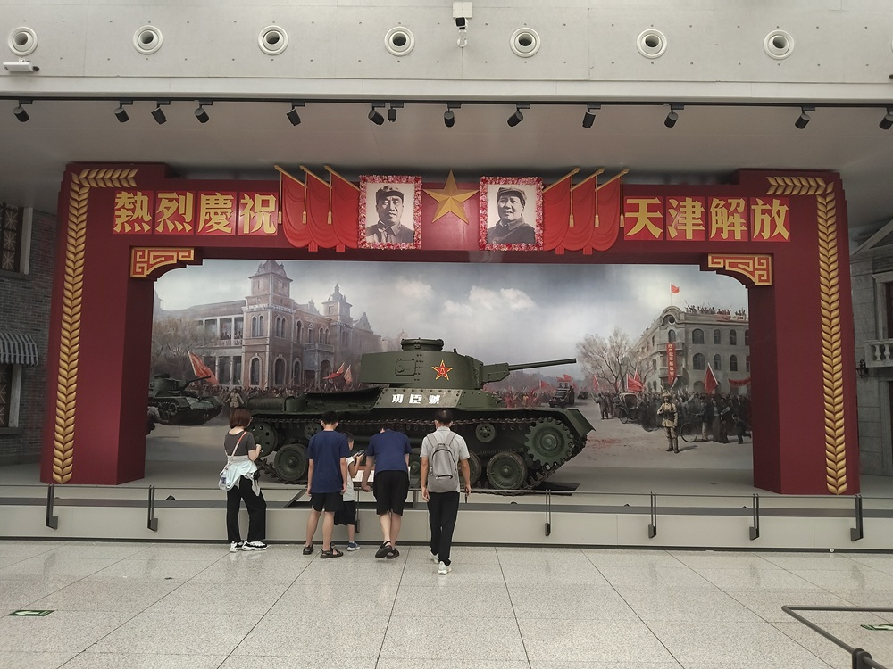
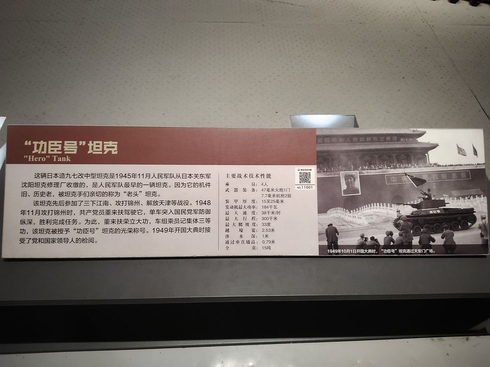

# 功臣号坦克

这辆日本造九七改中型坦克是1945年11月人民军队从日本关东军沈阳坦克修理厂收缴的，是人民军队最早的一辆坦克。因为它的机件旧、历史老，被坦克手们亲切的称为“老头”坦克。

该坦克先后参加了三下江南、攻打锦州、解放天津等战役。1948年11月攻打锦州时，共产党员董来扶驾驶它，单车突入国民党防御纵深，胜利完成任务。为此，董来扶荣立大功，车组乘员记集体三等功，该坦克被授予“功臣号”坦克的光荣称号。1949年开国大典时接受了党和国家领导人的检阅。

主要战术技术性能：

- 乘员：4人
- 武器装备：47毫米火炮1门  7.7毫米机枪2挺
- 装甲厚度：15至25毫米
- 发动机最大功率：184千瓦
- 最大速度：38千米/时
- 最大行程：300千米
- 最大爬坡度：33度
- 越壕宽：2.53米
- 涉水深：1米
- 通过垂直墙高：0.79米
- 全重：15吨

功臣号坦克，是人民军队的第一辆坦克，被坦克手们亲切的称为老头坦克。功臣号坦克，先后参加了三下江南、攻打锦州、解放天津等战役。在1949年10月1日，功臣号坦克作为开国大典坦克方队的第一车，率先通过天安门广场，接受了党和人民的检阅。

## 九七式中型坦克

功臣号坦克，是一辆九七式中型坦克。九七式坦克，是日本第二次世界大战期间装备的中型坦克，由日本三菱重工业公司1937年设计定型。1938年开始装备日军，一直服役到1945年，共装备了1500多辆，在二战期间被日军广泛使用。97是日本天皇纪年2597年（公元1937年）的后两位数。

## 装甲兵第一车

1945年11月，东北民主自治军的高克等人，奉命到沈阳九一八工厂(原日本关东军坦克修理厂)侦察敌特活动情况，无意中发现了几辆日军的坦克。乘人不备，高克和俘虏的日本人各驾着一辆正在修理的坦克，冲出修理厂大门。开到沈阳铁道西，停放在一个被破坏的工厂里。

高克留下几名战士看护坦克，又带领几名工人继续寻找车辆和器材、零件。晚上，组织人员进行修理。在几名老工人的帮助下，经过十几天的收集和修配，修好了两辆坦克、两辆装甲车、两辆牵引车和一辆汽车。

敌情紧急，司令部命令高克等，驾驶坦克和车辆向吉林通化转移。经过一天行进，由于坦克和车辆故障太多，不得不停在沈阳西北的小桥子屯。临时拉进来的工人中，混进了敌特分子。趁着高克带领战士打探道路还没有回来的时机，敌特分子发动暴动，破坏了大部分坦克和车辆，逃回沈阳。只有一辆坦克，在部分工人的保护下，得以幸免。高克等人返回后，看到如此情景，非常痛心和气愤。为了保全剩下的这辆九七式中型坦克，只好暂时住在小桥子屯，等待部队来人接应。

民主自治军司令部失去了同高克等人的联系后，派出曾学习过坦克技术的孙三，带领骑兵警卫排向沈阳西北寻找。经过两天的四处打探，终于在小桥子屯找到他们。

敌情越来越紧急，上级要求高克、孙三等带上可以带走的坦克器材迅速转移。但是，坦克由于破坏严重无法行进，必须去搜集器材，重新修理。经研究决定，孙三率警卫排再闯沈阳九一八工厂抢器材，高克率领剩下人员修理坦克。孙三带人抢回一车的器材、零件，高克等人修理好坦克。

敌情已经非常紧急，高克、孙三等驾驶着那辆修理好的坦克和一辆装满器材、零件的汽车，向东北炮兵司令部所在地马家湾子开进。到了马家湾子，坦克的隆隆声惊动了炮兵司令部全体人员，他们围着坦克转了一圈又一圈。

时任东北炮兵司令员兼炮兵学校校长的朱瑞，紧紧握着高克和孙三的手说：“你们开来的不是一辆坦克，你们给我军带来了一支装甲部队。”

当晚，炮校首长宣布东北局的决定，在炮校附设坦克大队。东北坦克大队，是当时各解放区中，第一个正式建立的坦克部队。一辆普通的九七式中型坦克，也传奇般地成了人民解放军装甲兵历史上的第一车。

## 功臣号坦克

我军第一辆坦克，资格最老，机器最旧，培养出的坦克手和修理工最早，被亲切的称为老头坦克。

1948年攻打锦州时，老头坦克遇到了最佳搭档，驾驶员董来扶。因为故障太多，老头坦克本来没有承担任务。董来扶和车长牛生贵一起写了请战书，保证能上阵杀敌。于是，他与全车乘员一起，抢修老头坦克。饭在车边吃，困了就在车里打个盹儿，机油把头发粘成绺也顾不上洗。

接到出发命令时，全团坦克都上了火车，唯有老头坦克，还停在车库里不能发动。董来扶再次向领导保证，只要把坦克拖上火车，在赶到前线之前，一定能把坦克修好。在他们的一再保证下，大家把老头坦克拖上了火车。在开往前线的火车上，董来扶和全车乘员，夜以继日，一直陪伴在老头坦克身边，聚精会神地检修。真是功到自然成，到达驻地后，老头坦克在隆隆声里，大摇大摆地走下火车。战友们都围了上来，把董来扶高高地抬起。

由于坦克大队是第一次参加大规模城市攻坚战，要想打得漂亮，驾驶员的操作能力很重要。

战斗中，坦克在炮兵火力的掩护下，冲过了几道战壕，碾过数道铁丝网之后，前面便出现了一大段开阔地。为避免坦克被敌炮火击伤，董来扶双手轮换急拉操纵杆，使坦克蛇行前进。只见坦克周围腾起一股股炸烟，敌人的炮弹一颗颗都落空了。当坦克冲到铁路桥前时，一道石墙挡住了坦克的去路。这时，步兵很难前进一步，石墙上面，敌人的机枪封锁了步兵前进的道路。一阵阵密集的火力，压得步兵抬不起头来。坦克炮一阵猛烈的轰击，石墙被打开了，步兵在一阵喊杀中冲过了石墙，敌人的防线被突破了。

经过短暂的停歇后，老头坦克又开始了第二次冲击。这时，步兵已进入巷战。敌人在街道口堆起各种障碍物，碉堡星罗棋布，步兵每前进一步都得付出很大的牺牲。正当坦克碾过障碍，摧毁了碉堡，领步兵前进时，董来扶发现，车温突然升到95度。他马上意识到：机油冷却器被弹片击伤了，机件润油受到影响。董来扶冒着炮火进行战地抢修。

天已经黑了，枪声和火光就是战斗命令。董来扶开着修好的坦克向火光冲去，把第二梯队的步兵带到锦州老城下，胜利完成了第三次冲击。

第四次冲击，是老头坦克单车完成的战斗任务，消灭了敌人的火力点，攻克了敌人固守的火车站。

最后一次冲击，是攻打锦州老城。这是解放锦州的最后的一次战斗。当时，敌人龟缩在老城里，妄图依仗城墙和护城河进行顽抗。老头坦克迎着炮火走在坦克队列的前面，且战且进。炮弹和手榴弹像冰雹一样从城墙袭来，河岸烟尘四起，河中水柱冲天，一场大战正在紧张时刻，坦克冷却器第二次被击伤。坦克虽不能行动，但并没有停止战斗。充分发挥了坦克的火器威力，紧紧压住敌人的炮火。炮手只几发炮弹，便打掉了城内的敌人指挥所。当敌人的指挥所起火时，一阵喊杀声，震动了整个战场，步兵像一阵暴风，纷纷越过护城河，爬上了城墙。这时，从坦克的瞭望孔可以看到城上的敌人已打出了白旗。

战后，第四野战军司令部、政治部命名老头坦克为“功臣号”坦克，荣记集体三等功。董来扶和机枪手吴佩龙荣立一等功。

## 开国大典第一车

辽沈战役结束后，老头坦克又随第四野战军南下，参加了平津战役。在攻打天津的战役中，老头坦克在敌人集火打击情况下，摧毁敌人一个又一个碉堡。特别是在进攻金汤桥战斗中，主动出击，吸引敌火力，先后摧毁敌3个暗堡、5个火力点，率先攻克金汤桥。

北平和平解放，老头坦克参加了入城式。1949年3月25日，党中央、中央军委从河北平山县西柏坡移到北平，毛泽东在北平西苑机场检阅了包括“功臣号”在内的装甲部队。

在开国大典上，董来扶驾驶着“功臣号”坦克作为首车，率领100多辆中型坦克、重型坦克通过天安门广场，接受了党和国家领导人的检阅。

在1937年秋天，毛主席就说：“我们现在还没有一辆坦克，也没有大炮，但是有一批懂技术的干部了。有人，就一定能把特种兵建立起来，坦克和大炮敌人会给我们送来的。”

1945年8月8日，日本无条件投降。驻南泥湾的八路军炮兵学校里接到中央军委指示：派人到东北战场，收缴日军坦克，建立特种兵部队。
1949年10月1日开国大典时，新中国还没有批量生产坦克的能力，坦克方队的坦克全部都是缴获的外国坦克。

## 五代传承

1959年，中国自主生产的第一代59式坦克开始列装部队。从此，老“功臣号”坦克光荣退役，但“功臣号”作为一个有着光荣历史的车号，在中国人民解放军编制序列中一直延续。“功臣号”教育官兵勿忘革命历史，赓续红色基因，让“勇往直前、战无不胜”的“功臣号”精神薪火相传。

拥有光辉历史的中国人民解放军首支装甲部队“功臣号”连，已经换装99A式主战坦克。在“地表最强”的解放军第五代“功臣号”入役的同时，当年仅靠一台日本“老头坦克”打天下的“功臣号”所在部队也已经发展为解放军新一代“土豪旅”。功臣号”坦克历经五次换装更，从缴获的日本坦克升级为最新锐的99A主战坦克。