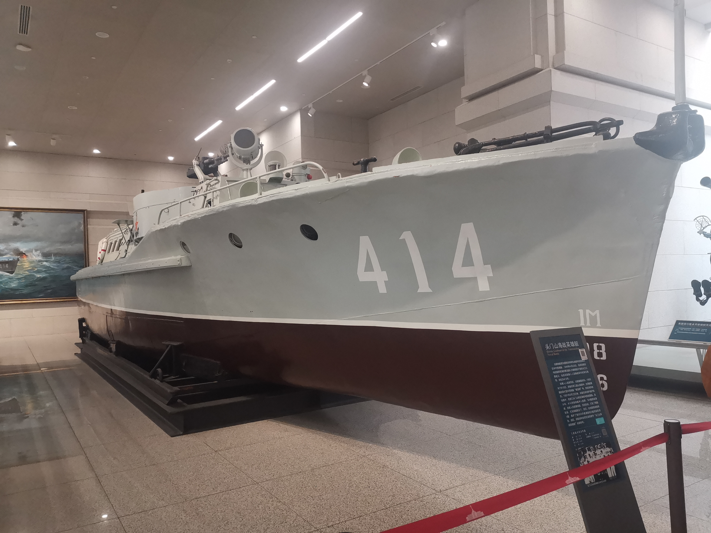

# 头门山海战英雄艇

这艘炮艇原为国民党海军抗战胜利后接收的日本中型炮艇。1949年4月23日，包括该艇在内的国民党海防第2舰队25艘舰艇于南京长江江面起义，此后该艇编入人民解放军华东军区海军，命名为414号。

自编入人民海军后，该艇屡建战功。1950年7月10日，该艇在浙江披山海战中，先用艇艏撞伤敌大型木壳炮艇“新宝顺”号，然后将其击沉。1951年6月23日夜，该艇在承担护渔护航任务中，在浙江头门山附近海域于敌船遭遇。战斗中，414号艇单艇冲入敌群，与4艘敌船激战，全艇人员英勇顽强，灵活机动，打乱了敌船的队形，在兄弟艇的配合下，击沉、击伤敌机帆船各一艘，保护了我900多搜渔船和3艘货船的安全。战后，该艇被华东军区海军授予“头门山海战英雄艇”光荣称号。

主要战术技术性能：

- 艇长：17米
- 艇宽：3.8米
- 航速：11节
- 排水量：25吨
- 吃水：1.2米
- 武器装备：25毫米机关炮1门，7.7毫米机枪1挺

头门山海战英雄艇，舷号414，是一艘功勋卓著的中型炮艇。414艇，曾是日本军国主义侵略中国的帮凶，也曾见证国民党海防第二舰队南京笆（bā）斗山起义的光荣时刻。在人民海军创建初期，不怕困难，不畏牺牲，在保卫海疆中建立了功勋。

## 英雄的来时路

抗战时期，日本海军针对我国南方水网密集的特点，研发了一款中小型内河炮艇。总计建造77艘，其中大部分部署在我国南方地区。因其排水量25吨多，国内称为日制25吨型炮艇。

炮艇采用平甲板艇型，驾驶室为装甲半埋式结构，艇上部配有机枪和迫击炮，艇体的后半段为载员舱，可搭载约两个班的陆战队人员，主要用于水网密布地区小规模的快速登陆，或对地火力支援作战。吃水较浅、机动灵活，适合江河湖泊行驶，也能在近海风浪较小的区域行驶。

日本战败投降后，25吨型炮艇，被国民党海军接收。1949年4月23日，海军名将林遵率领国民党海防第二舰队30艘舰艇、海军官兵1271人，在南京笆斗山长江江面光荣起义，被毛泽东、朱德称为“南京江面上的壮举”。这一天，也是华东海军，也就是人民海军，成立的日子。414艇就是参加起义的一艘炮艇。

新中国成立后，25吨型炮艇成为人民海军第一批炮艇部队的主力，被赋予近海保卫任务，参加了海上作战。414艇原隶属于华东海军温台巡防大队，曾在披山、檀头山、东矶列岛等，浙东沿海剿匪作战中屡建功勋。

## 海上拼刺刀

1950年7月11日，华东军区组成登陆输送队突袭披山岛，包括414艇在内的25吨型炮艇4艘、2艘登陆艇，以及装载陆军2个步兵营的机帆船30余艘。

7月12日拂晓，到达披山岛海域后，炮艇即向停泊在披山岛锚地内的国民党军艇船发起突然袭击，多艘国民党军艇船仓皇逃出锚地。

我以3艘炮艇进行追击，并集中火力攻击其“精忠1号”炮艇，迫使该艇投降。

第4艘炮艇，将国民党军“新宝顺”号炮艇堵在锚地内，向其猛烈射击，后开足马力猛撞其尾部，致使该艇后舱进水。随后，2艘增援炮艇接舷近战，跳上新宝顺号，使用炸药包和手榴弹将其炸沉。

25吨型炮艇为数不多，又经过十多年服役，艇况已经不好。披山海战暴露出，原有武器装备火力不足的问题，于是海军对武器装备进行了适当升级改装。部分炮艇，在驾驶舱顶部换装一门25毫米机炮。

披山海战，以小艇撞大舰、跳帮作战等海上拼刺刀战法，表现出革命军人的大无畏精神，为以后的海陆协同作战积累了不少经验。

## 头门山海战英雄艇

朝鲜战争爆发后，国民党企图干扰东南沿海地区的交通要道，其中包括三门湾航道。狭长弯曲的三门湾航道，是中国与世界联系的重要通道。三门湾航道被国民党部队切断，导致交通受阻。

1951年6月23日，华东财政经济委员会3艘运粮船由坡坝港驶往海门，另外有900多艘渔船由石浦返回台州，请求人民解放军海军护航。为防止敌舰截击商船，保护海上交通和渔民生产，华东军区海军舟山基地决定派出温台巡防大队的炮艇分队，护航船队通过三门湾航道水域。

敌人的庞大舰队与解放军的小炮艇，形成了强烈的对比，敌我力量悬殊。因此，414艇和其它几艘炮艇，必须巧妙地绕至南泽和北泽附近，埋伏等待时机。

4艘炮艇（411、413、414、416），降下国旗，伪装成普通的渔船，由石浦港起航，天亮时达到设伏海域。海上雨雾弥漫，只能靠听觉辨别。忽然，战士们听到西南头门山方向，海上有枪声，立即高速出航。

指导员陈立富率414艇一马当先，途中因为发现可疑敌情，416艇离队前往检查，411、413两艇又出现机器故障掉队，只剩下414艇继续朝枪声密集的方向驶去。在迷雾中，414艇意外地闯入，敌人在白沙山岛以东海面的包围圈。4艘庞大的敌船，是配有火炮和机枪的大型机帆船，其中1艘三桅大机帆船拦头截住了3艘运粮船的去路。其余3艘正把运粮船压向岛岸，准备抢劫。

414艇只有12名官兵，装备上处于明显劣势。陈立富迅速发出信号，让敌人误以为414艇是自己人，从而停止了对船队的进攻。然后，414艇突然开火，迅速打乱了敌人的部署。首先击伤其中一艘大型机帆船，救出了被围困的运粮船。敌船见势不妙，掉头向头门山岛方向逃窜，414艇不顾敌船火力威胁，紧追不放。

当敌船驶到头门山附近海域时，很快分成两队，掉过头来从左右两侧发起反击，头门山岛上的敌人也加入战局。414艇毫不示弱，冲到距离敌船100米左右的地方，独自向一艘三桅大机帆船猛烈射击。战斗中414艇机枪发生故障，敌船乘机反击，1发炮弹击中414艇艇尾油桶，后甲板燃起大火，艇上5人负伤，枪炮兵王维福多次负伤仍坚持战斗。

随后，416艇很快跟上，411、413两艇排除故障也赶到。4艇会合共同打击敌船，在一江山岛以南将1艘双桅机帆船击沉，其余敌船见势不妙慌忙向一江山岛、大陈岛方向逃去。

海军炮艇部队果断追击，击沉敌大机帆船1艘，击伤3艘，毙敌30余人，成功掩护了3艘运粮船安全通过，保护了900多艘渔船安全生产。

头门山海战中，414艇深入敌群，孤艇作战，战绩突出，被华东军区海军命名为“头门山海战英雄艇”，指导员陈立富和枪炮兵王维福获得“战斗英雄”称号。