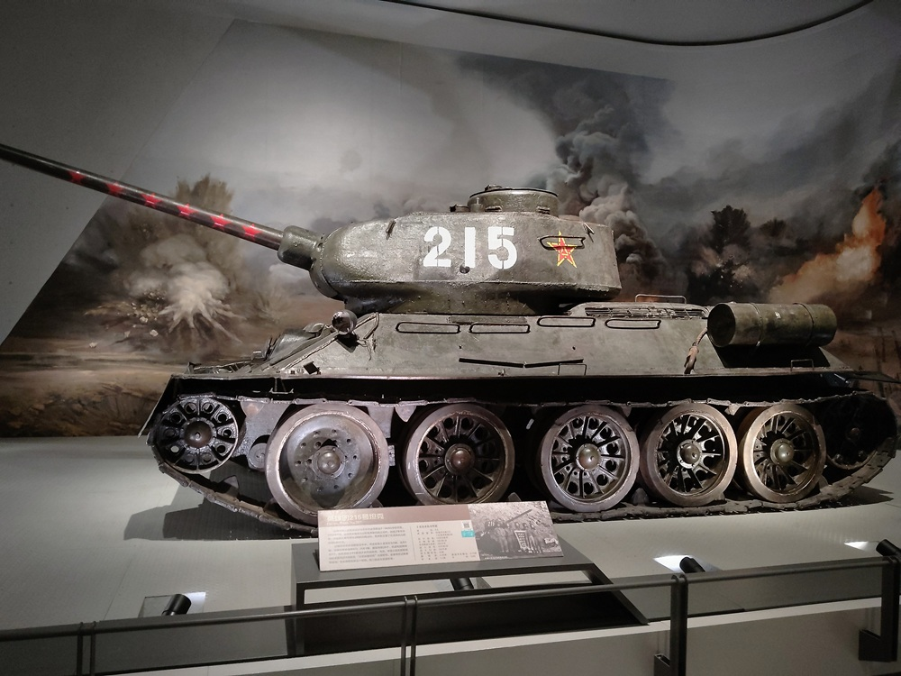
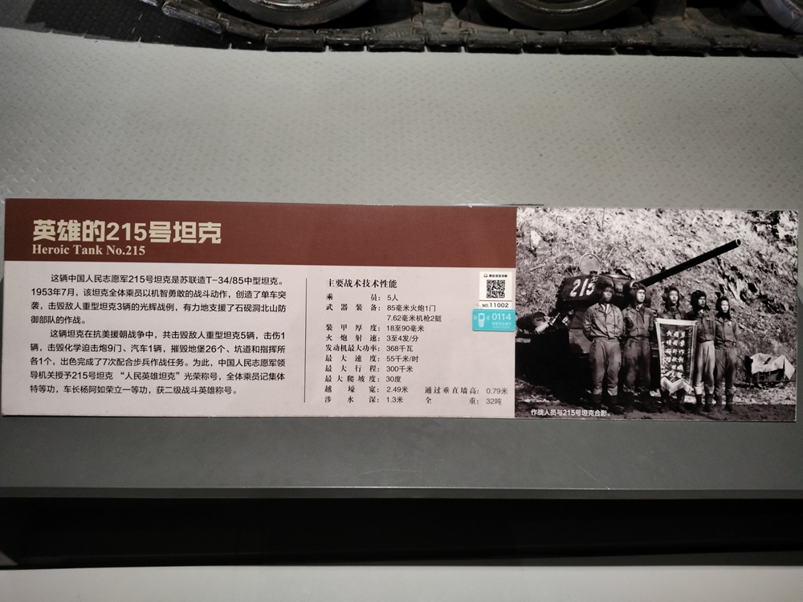

# 英雄的215坦克

这辆中国人民志愿军215号坦克是苏联造T-34/85中型坦克。1953年7月，该坦克全体成员以机智勇敢的战斗动作，创造了单车突袭，击毁敌人重型坦克3辆的光辉战例，有力地支援了石砚（yàn）洞北山防御部队的作战。

这辆坦克在抗美援朝战争期间，共击毁敌人重型坦克5辆，击伤1辆，击毁化学迫击炮9门、汽车1辆，摧毁敌地堡26个，坑道和指挥所各一个，出色地完成了7次配合步兵作战任务。为此，中国人民志愿军领导机关授予215号坦克“人民英雄坦克”光荣称号，全体乘员记集体特等功，车长杨阿如荣立一等功，获二级战斗英雄称号。

主要战术技术性能：

- 乘员：5人
- 武器装备：85毫米火炮1门  7.62毫米机枪2挺
- 装甲厚度：18至90毫米
- 火炮射速：3至4发/分
- 发动机最大功率：368千瓦
- 最大速度：55千米/时
- 最大行程：300千米
- 最大爬坡度：30度
- 越壕宽：2.39米
- 涉水深：1.3米
- 通过垂直墙高：0.79米
- 全重：32吨

志愿军215号坦克，是苏联造T-34/85中型坦克，乘员5人，车长杨阿如。在抗美援朝战争期间，共击毁敌人重型坦克5辆，击伤1辆，击毁化学迫击炮9门、汽车1辆，摧毁敌地堡26个，坑道和指挥所各1个，出色地完成了7次配合步兵作战任务。

## 志愿军装甲兵

在1950年10月，首批入朝参战的部队中并没有装甲兵。作为陆军的独立兵种，装甲兵司令部在9月刚刚成立。只有2个师零1个团，400余辆坦克，力量还很薄弱。装备也主要是解放战争中缴获的美制M3A3轻型坦克和日制97式中型坦克，性能较差，磨损严重，缺乏零部件，多数已经难以有效使用。1950年11月起，陆续装备了T-34中型坦克、IS-2重型坦克、SU-122自行火炮。

1951年3月，志愿军装甲兵部队开始入朝。此时的志愿军装甲兵部队，还是一支年轻部队，作战经验不足，在人员训练和装备数量上都无法与联合国军正面抗衡。就是在这样极不对称、极为艰难的条件下，新生的装甲兵部队弘扬革命英雄主义精神，英勇顽强、舍生忘死，经过艰苦卓绝的战斗，多次成功反制敌军坦克，有效支援步兵作战。英雄的215号坦克，就是最有力的证明。

## 抛锚也要战斗

1953年7月，坦克第2师第4团2连，在夏季反击战役中，担任主攻美军石砚洞北山阵地的作战任务。敌军在石砚洞北山346高地派出3辆M46坦克，像是插入志愿军阵地的一颗钉子，对我方造成严重威胁。志愿军独立坦克第4团2连2排排长兼215号坦克车长杨阿如，受领了拔钉子的任务。上级指示，务必在7月8日晚9点30分之前，消灭346高地上的3辆敌军坦克，配合步兵争夺石岘洞北山。

杨阿如奉命率3辆坦克，冒着敌人的炮火，在夜色和大雨的掩护下，缓缓朝着预设阵地前进。通向阵地的是一条只够一辆坦克通行的道路，那可是工兵们冒着炮火花了20多个夜晚，用泥土、木料和石头铺成的。前进的道路泥泞不堪，许多巨大的弹坑都被积水掩盖。在距离目标阵地不到300米，距敌1200多米的地方，坦克突然陷进了泥坑里。

杨阿如立即指示联系工兵，同时组织展开自救。工兵赶到后即刻投入救援，然而到了后半夜，坦克仍无法驶出。杨阿如及时向指挥所报告了情况。了解到215号的处境后，指挥所断然下达命令，陷在泥里也要打！敌人这3辆坦克对反击部队威胁极大，在战斗发起前5分钟内必须消灭掉。接受命令后，后边两辆坦克先退回去，215号坦克单独承担任务。

此时，天色已晚，夜幕成了最好的保护网。战士们用树枝、藤条和泥巴把坦克伪装成一个大土包，炮长徐志强将炮管摇向车后，看起来像一根靠在土包上的木头。战士们躲在坦克掩体里，对敌人的3辆坦克进行认真观察，提前标定好密位。次日度过了漫长的白天，敌人丝毫没有发觉。

黄昏时分，大家各就各位，瞄准第一辆敌军坦克，连续发射3枚穿甲弹，目标被击中燃烧起来，大火照亮了高地。另两辆敌军坦克反应过来，慌乱开始还击，敌人的炮弹不断落在215号坦克周围。215号坦克毫不畏惧，连续发射5发炮弹，第二辆敌军坦克燃起大火。坦克手们越战越勇，第三辆敌军坦克也被击中。215号坦克连续准确地射击，击毁敌人的M26坦克2辆，击伤1辆，完成了消灭敌人坦克的任务。

## 不怕疲劳，连续战斗

第二天，敌人的炮火更加猛烈，硝烟和焦土笼罩着阵地。坦克上所有的窗门都关起来，偶尔只能打开驾驶窗，呼吸一点新鲜空气。无线电员、炮长、驾驶员相继昏倒，指挥所要求他们留下两个人，把其他人员撤下去。可谁也不肯离队。全体乘员坚守在215号坦克上，共同度过了生死攸关的两天两夜。装填手兼预备炮长师凤山，在年迈时回忆往事仍然语气坚定：“人不能离武器，就是死在这儿，也不能离开坦克。”

为了避免被动挨炸，驾驶员陈文奎迅速发动坦克，猛踩一脚油门，让发动机大声吼叫，然后慢慢降低油门，逐渐压低发动机声音，最后把坦克熄火，故意制造我方坦克已经撤出阵地的假象。敌人上当了，炮火沿着坦克可能退却的道路，狂轰滥炸地延伸了2千多米。原地未动的215号坦克毫发未损。

7月10日早上，215号坦克收到指挥所新命令：消灭敌方高地上新调进的2辆坦克。面对新的作战命令，已经十分疲惫的官兵，以常人难以想象的顽强毅力再次行动起来。为了躲开敌机侦察和狙击手偷袭，先把泥和草捆在身上，将自己伪装起来。然后，爬到几百米以外的山上把被敌人炮火炸断的树干，用绳子栓住，然后捆在腰上往回拖，有时连滚带爬。冒着敌人的炮火不知往返多少次，终于在临近傍晚时聚集了70多根木头，垫平道路，将坦克开出了弹坑。

午夜，战斗打响。215坦克仅用了11分钟，以44发炮弹的代价，击毁敌M26坦克2辆，地堡12个，机枪巢3个，小口径炮3门。

215号坦克的乘员们在坦克陷入困境的情况下，不畏艰难、沉着应战，顽强坚持战斗3天3夜，并胜利地完成战斗任务，安全地撤回了后方，实现了“人与装备最佳结合”的生动演绎。

战后，志愿军总部授予215号坦克“人民英雄坦克”光荣称号，全体乘员记集体特等功。