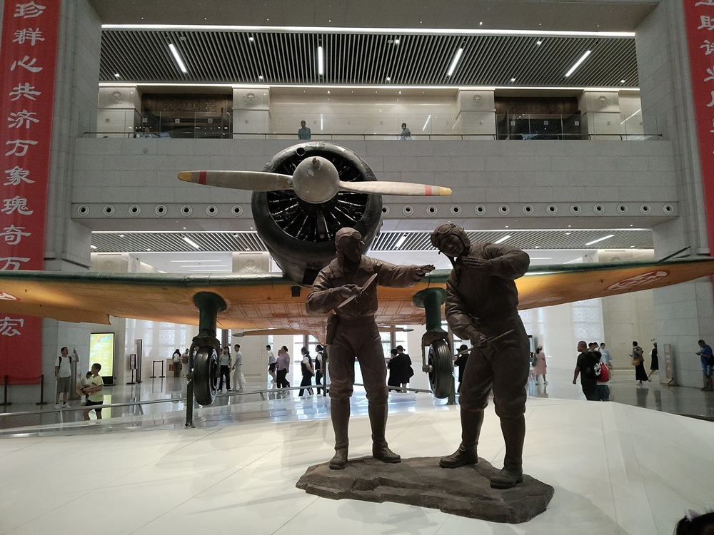
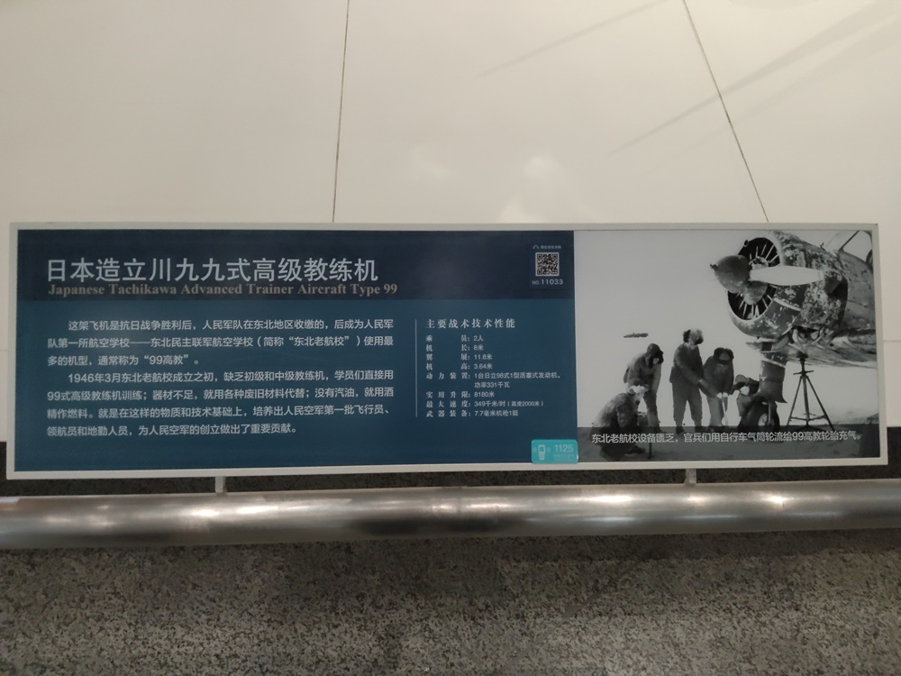

# 日本造立川九九式高级教练机

这架飞机是抗日战争胜利后，人民军队在东北地区收缴的，后成为人民军队第一所航空学校——东北民主联军航空学校（简称“东北老航校”）使用最多的机型，通常称为“99高教”。

1946年3月东北老航校成立之初，缺乏初级和中级教练机，学员们直接用99式高级教练机训练；器材不足，就用各种废旧材料代替；没有汽油，就用酒精做燃料。就是在这样的物质和技术基础上，培养出人民空军第一批飞行员、领航员和地勤人员，为人民空军的创立做出了重要贡献。

主要战术技术性能：

- 乘员：2人
- 机长：8米
- 翼展：11.8米
- 机高：3.64米
- 动力装置：1台日立98式1型活塞式发动机，功率331千瓦
- 实用升限：8180米
- 最大速度：349千米/时（高度2000米）
- 武器装备：7.7毫米机枪1挺

日本造立川九九式高级教练机，就是99高教，又叫99高练，是日本1939年生产的高级教练机。99高教是我军最早缴获的飞机，是东北老航校和第7航校的主力教练机型，也是东北老航校使用最多的高级教练机。抗美援朝中的王海等志愿军空军战斗英雄，就是在东北老航校的99高教上完成的飞行训练。在人民空军的发展历程中，99高教功不可没。

## 99高教

99高教是立川飞行机株式会社研制的下单翼高级教练机，由立川飞行机株式会社、川崎航空机工业株式会社制造。

99高教，乘员2人，机长8米，翼展11.8米，机高3.64米，机翼面积20平方米，空重1292千克，全重1721千克，采用两叶可变距螺旋桨，配备7.7毫米机枪1挺。最大速度349千米/时（高度2000米），巡航速度235千米/小时，实用升限8180米，高度3000米爬升时间6.9分钟，最大航程1060千米，起飞滑跑距离235米，着陆距离290米（着陆速度100千米/小时）。

99高教在1939年4月首飞，1939年7月被日本陆军正式采用。1940年，开始全面部署，作为新型教练机在日本陆军飞行学校被广泛使用。1945年，九九高教从日本陆军退役，成为99高教最早退役的国家。

1949年11月，中国人民解放军空军正式成立时，23架99高教都在第7航空学校使用。1953年最后14架退役，中国成为99高教最后退役的国家。

目前是十分珍贵的文物，已知仅保存有3架，1架在中国人民革命军事博物馆，1架在中国航空博物馆，另1架在泰国皇家空军博物馆。

## 东北老航校

从1946年3月至1949年9月，在短短的3年零9个月里，东北老航校共培养出各种航空人才560名。其中，飞行员126名，机务人员322名，领航员24名，场站、气象、通信、仪表、参谋人员88名。后来大多成为建设人民空军和创办、发展新中国航空事业的骨干。东北老航校为人民空军和新中国航空事业的发展，建立了不朽的功绩，成为人民空军的摇篮，是中国航空事业发展史上的一座丰碑。

1949年10月1日，开国大典阅兵式上，东北老航校的飞行员们驾驶着17架战机，以编队形式飞越天安门广场。他们克服了飞机机型复杂、排练时间短等重重困难，严格遵守飞行规定，完美地完成了飞行任务，赢得了党和国家领导人以及人民群众的热烈掌声。

## 机徽

东北老航校早期使用的99高教，为隐瞒身份免遭国民党空军空袭，以国民党空军的青天白日机徽涂装机身与机翼。机徽外镶白圈，与国民党空军的机徽有一点儿细微差别，以便我军识别。尾翼则是四蓝条间三白条。后来，国民党空军也发现了这个秘密。

之后涂装沿用日本样式：上部是绿、土棕、黑色的迷彩，以使国民党空军空中不易察觉；下部是醒目的橘红色，而不是和天空近似的蓝、灰色，以方便我军地面人员观察。机徽则是红五星中间嵌入一个中字，这是任弼时同志为东北老航校专门设计的，可以算是我军最早的机徽版本。尾翼则是四红条间三白条。从1947年5月一直使用到1949年9月，共两年零4个月。

最后，统一使用了标准的解放军空军机徽。

## 直上高教，一步登天

按照飞行训练常规，要以初级教练机、中级教练机、高级教练机的顺序进行。航校当时没有中级教练机，只有四架英格曼式初级教练机，木制机体经过风吹雨淋，已破旧不堪。

在研究讨论中，有的同志提出：干脆一步登天，直接上九九高教机训练。日籍飞行教官林保毅摇头反对，用世界各国探索的三级训练法告诉大家，直上高教将要面对生死风险。

于是，大家开始讨论直上高练的可能性和具体困难。校长常乾坤总结大家的意见，以飞机性能发展的科学数据，说明直上高练的可能性，并提出了增加地面练习和带飞时间、教员严格要求、学员刻苦学习、没有把握不放单飞等措施，增加了教学人员的信心。

7月下旬，一架99高教的尾翼拴上了红布条，这是新飞行员放单飞的标志。第一个放单飞的是吴元任，曾在新疆八办航空训练班和安塞工程学校学习过，有基础，训练进度快。常乾坤一声令下，吴元任驾机滑行，机头抬起来，飞机离开了跑道，飞上天空。在航校任教的日籍教官由衷地赞叹：“奇迹，真是奇迹！我们今天真正明白了中国共产党人无往不胜的道理！”

直上高练成功了！

虽然飞机只飞了一个起落，但却是了不起的一步。甲班12名学员，平均只由教员带飞了15个小时，就驾驶99高教，实现了一步登天的梦想。

### 以酒精代航油

1946年夏开飞以后，随着飞行训练时间的增加，面临缺乏油料的严重困难。航校从缴获的日本资料中发现，日本投降前，曾因缺乏油料，一度用无水酒精代替汽油进行飞行训练。

经过上百次试验，在把汽化器喷嘴加大到2.5毫米、酒精纯度提高到96%的情况下，调整进气阀和排气阀的间隙及点火位置，发动机可以正常运转。因为酒精难以直接启动发动机，就增加一个汽油箱。开车时先用汽油启动，然后再转用酒精。经过多次地面试车，发动机最大转速符合飞行要求。

为了尽快生产大批量高纯度酒精，6月初，航校派徐昌裕、胡华钦和郦少安、熊焰分别接管哈尔滨两家酒精厂，筹备生产高纯度酒精。

在中共中央东北局和东北民主联军总部关心和支持下，1946年9月，生产出可用作飞机燃料的酒精。9月上旬，航校副校长白起和日籍教员黑田，驾驶装满酒精的飞机飞上蓝天，上升、下滑、平飞、转弯，一切正常，并稳稳着陆。试飞成功。

用酒精代替航油，是航空训练保障史上的重大创新，不仅缓解了汽油供应的压力，也为飞机燃料的多样化提供了新的思路。

1947年，航校与苏联达成了油料供应协议，通过用当地物资换取苏联油料，结束了以酒精代油的飞行历史。