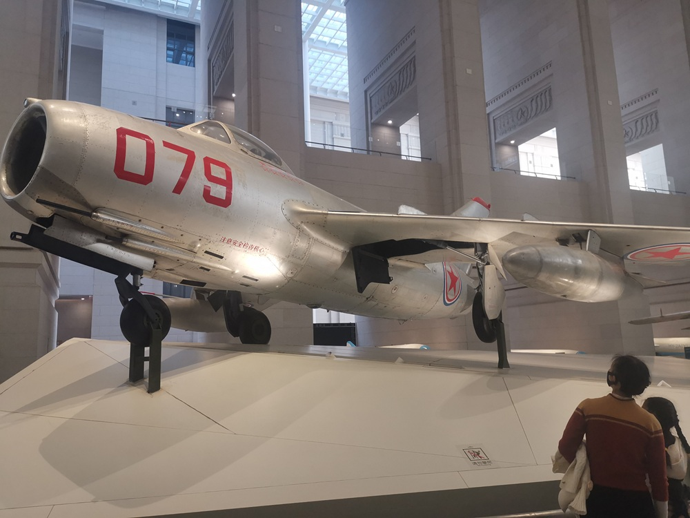
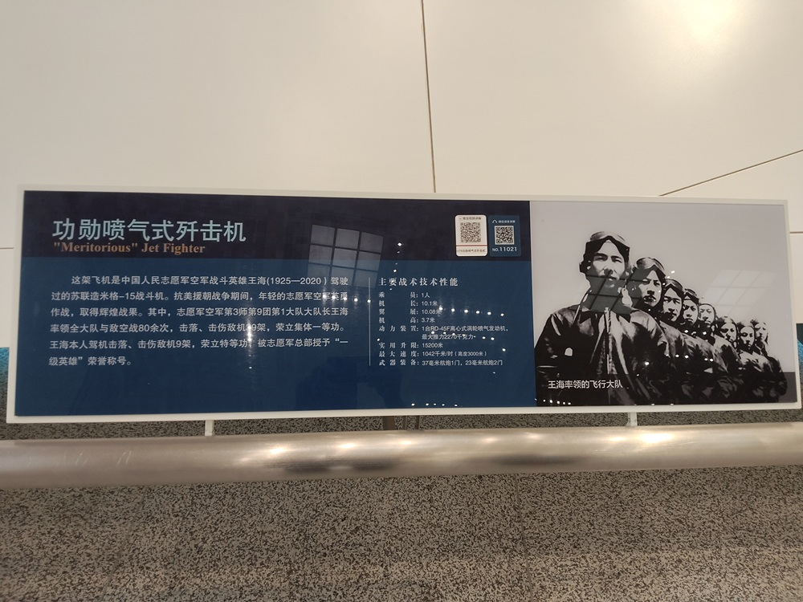
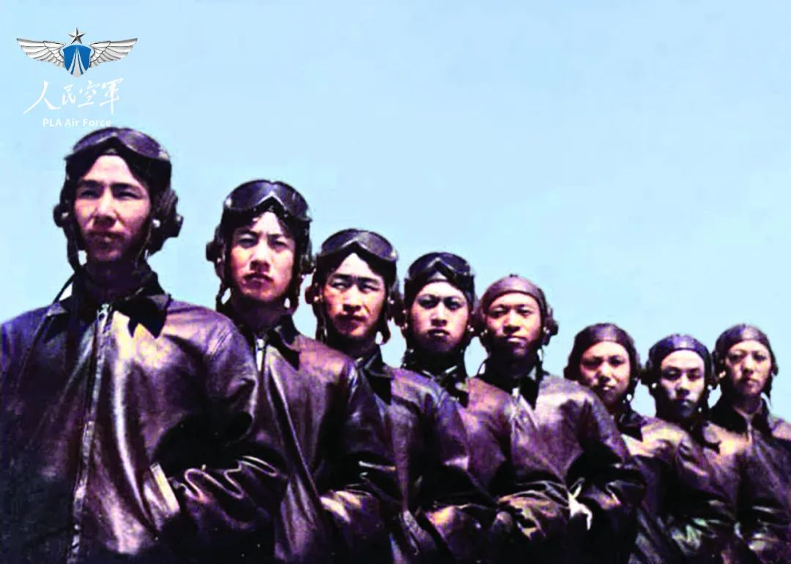

# 功勋喷气式歼击机

这架飞机是中国人民志愿军空军战斗英雄王海驾驶过的苏联造米格-15战斗机。抗美援朝战争期间，年轻的志愿军空军英勇作战，取得辉煌战果。其中，王海率领的飞行大队与敌空战80余次，击落击伤敌机29架，荣立集体一等功。王海本人驾机击落击伤敌机9架，荣立特等功和一等功，被志愿军总部授予“志愿军一级战斗英雄”称号，朝鲜民主主义人民共和国授予他二级国旗勋章和军功章各1枚。飞机上的9颗红星就是他击落击伤9架敌机的标志。

主要战术技术性能：

- 乘员：1人
- 机长：10.1米
- 翼展：10.08米
- 机高：3.7米
- 动力装置：1台RD-45F离心式涡轮喷气发动机，最大推力2270千克力
- 实用升限：15200米
- 最大平飞速度：1041千米/时（高度3000米）
- 武器装备：30毫米航炮1门，23毫米航炮2门

编号079的功勋喷气式歼击机，是志愿军空军战斗英雄王海驾驶过的苏联造米格-15战斗机。王海率领的飞行大队荣立了集体一等功，王海本人则荣立特等功和一等功。战斗机座舱一侧的9颗红星，就是他击落击伤9架敌机的标志。

## 战斗英雄

对于特等功和一等功，大部分人可能只感觉功勋卓著，并没有什么具体的概念。

全军挂像英模邱少云同志，是特等功。为了不暴露目标，不影响作战计划，邱少云同志忍受烈火烧身的痛苦，直到最后英勇牺牲。

另一位，志愿军机枪连班长蒋诚同志，在上甘岭战役的反攻战斗中，在敌人的炮火封锁下带领班里的战士，以重机枪歼敌400余名，击毁敌重机枪一挺，击落敌机一架。蒋诚同志腹部受伤，自己把流出的肠子塞回去，在身负重伤的情况下仍不下火线，配合步兵完成了任务，对战斗胜利起到了重大作用。这是一等功。

## 入朝作战

1951年10月，王海大队开赴前线，踏上了抗美援朝的征程。

进入11月，志愿军正式吹响空战的号角，兄弟团队捷报频传，王海大队却屡屡空手而归。出师未捷的王海大队，并没有气馁，而是积极的总结经验教训，认真准备接下来的战斗。

11月8日，王海大队飞越清川江，发现美军12架飞机。双方速度极快，一闪而过。他们正要转身追击，带队长机评估形势后，决定不攻击。然而美军飞机却突然回转，从背后向王海大队袭来。危急时刻，7号机飞行员马宝堂单机掉头迎敌，冲散美机编队，成功的掩护了大队安全返航。这一次没有取得战果，却是王海大队与敌人的第一次真正交锋。

第二天，他们再度出动，首战告捷，成功击落一架敌机。不过，王海他们对这场战斗不太满意。在配合作战、使用战术以及控制弹药方面还有不少问题。

11月18日，王海大队在清川江附近，发现低空有60多架F-84飞机盘旋活动。趁敌机未察觉，王海大队当机立断，发挥米格-15战机垂直机动性强的特点，迅速爬升至6000米高空，然后急速俯冲直扑敌机。经过连续猛攻，王海和僚机焦景文各击落2架敌机，4号机孙生禄将一架敌机打得凌空开花，创造了5:0的辉煌战绩。

截止1952年1月14日第一次轮战结束，王海大队共击落击伤敌机15架，创造了15：0的惊人战绩，一跃成为空军的王牌大队。

飞行时间只有几十个小时的年轻飞行员们，不畏强敌，敢于空中拼刺刀。王海大队两次入朝作战，与号称世界王牌的美国空军，激战80余次，击落敌机29架，王海本人击落敌机9架。

## 米格-15

米格-15是苏联米高扬设计局研制的第一代高亚音速喷气战斗机，是苏联第一种后掠翼喷气式飞机，已初具现代战斗机雏形。

米格-15采用头部进气，机身上方为水泡形座舱，内置弹射座椅。米格-15有1门37毫米航炮，2门23毫米航炮，能携带200发炮弹。

米格-15在第一代喷气战斗机中，性能优异。飞行速度、火力、机动性远远优于美国的F-80和F-84，只有美军的F-86可与之匹敌。米格-15的37毫米航炮可轻松地击穿F-86的飞机装甲。虽然在水平盘旋、俯冲加速性和作战半径上不如F-86，但由于推重比大，爬升性能出众，因此在垂直机动性方面压倒了美国当时的所有同类飞机。

在朝鲜战争的空战中，米格-15显示出的优良性能，使美军千方百计想弄到一架完整的米格-15，以揭开它的秘密。美军先采取空中围捕迫降，没能得手。后来，又用俄、中、朝3种文字印了100多万张传单，声明驾驶米格-15飞机“投诚”，可得到100万美元的重奖，仍无所获。

直到朝鲜战争结束两个月后，朝鲜人民军的一架米格-15误入韩国境内，美国才如获至宝，立即将米格-15运往美国，反复研究，但此时价值已经不大了。

## 英雄的王海大队

王海说：敌人是一个人，我们也是一个人，脑袋别在裤腰带上，什么问题都解决了。我们的大队没有一个孬种！

从抗美援朝时几乎没有空战经验，到如今驾驭新质作战平台，王海大队的飞行员们在空军作战部队5次率先改装新型战机，始终奋飞在捍卫祖国利益的最前沿。

进入新时代，从飞越巴士海峡、飞越对马海峡，到巡航台岛、维权斗争，王海大队始终以不畏强敌、一往无前的血性胆气，有力捍卫了国家主权、安全和发展利益。

有一次任务紧急，不少飞行员把自己的工资卡交到教导员手中：“如果我回不来，请把工资卡交给我的家属。”当问到还有什么担心时，他们都说：“没有什么担心的，就担心不让我上！”