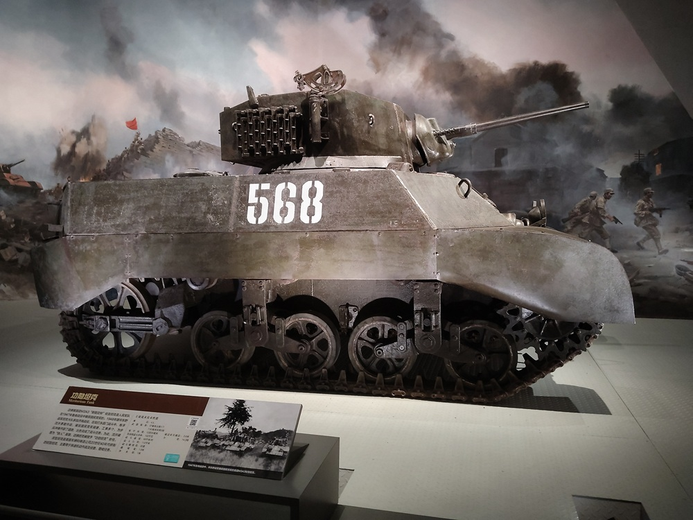

# 功勋坦克

这辆美国造M3A3“斯图亚特”轻型坦克是人民军队在1947年鲁南战役缴获国民党军的。1948年随华东野战军坦克大队参加济南战役，在攻打永固门战斗中，炮手沈许勇敢作战，摧毁国民党军碉堡、工事多个，为步兵冲锋开辟了道路，出色完成了战斗任务。为此，沈许被誉为“铁人”英雄，这辆坦克被授予“功勋坦克”称号。

该型坦克是美国车辆和铸造公司20世纪40年代研制的轻型坦克，主要用于快速机动作战及侦察、警戒任务。

主要战术技术性能：

- 乘员：4人
- 武器装备：37毫米火炮1门  7.62毫米机枪2挺
- 装甲厚度：12至55毫米
- 发动机最大功率：162千瓦
- 最大速度：58千米/时
- 最大行程：112千米
- 最大爬坡度：30度
- 越壕宽：1.8米
- 涉水深：1米
- 通过垂直墙高：0.6米
- 全重：14.3吨

由于在济南战役、淮海战役中表现优异，华东野战军于1949年9月，将功勋坦克的光荣称号授予特种兵纵队坦克大队102车朱德号，炮手沈许被授予坦克英雄荣誉称号。2019年中华人民共和国成立70周年阅兵式上，战旗方队的100面荣誉旗帜中，就有功勋坦克战旗。

## M3A3轻型坦克

功勋坦克是M3A3斯图亚特轻型坦克，是美国车辆和铸造公司20世纪40年代研制的轻型坦克，主要用于快速机动作战及侦察、警戒任务。乘员4人，装备1门37毫米火炮，2挺7.62毫米机枪。

1947年1月2日，山东野战军、华中野战军发起鲁南战役，全歼国民党军整编第26师和第1快速纵队。华东军政大学炮兵大队，奉命开赴前线接收缴获的大炮。结果意外地在战场上发现了国民党军队丢弃的一些坦克，有的身陷泥沟，有的被我军击毁。炮兵大队共搜集到美制M3A3坦克17辆、日制坦克6辆，最终有6辆美制M3A3坦克被修好。

1947年3月3日，以修好的6辆美制M3A3坦克为基础，组成了华东野战军特种兵纵队坦克队。其中3辆坦克状况相对较好，被分别命名为101车“毛泽东号”、102车“朱德号”、103车“陈毅号”。沈许因为综合素质高、有一定文化而被上级选中，成为第1区队102车朱德号的炮长。

## 阴差阳错的调虎离山

1948年9月17日，沈许所在的坦克队参加济南战役。当晚由于步、炮、坦协同脱节，致使进攻受阻，最终我军4辆坦克被迫退出战斗。虽然初战失利，但我坦克兵却并未气馁。

在支援华野9纵25师73团进攻济南外城东南角的永固门战斗中，坦克兵们向步兵指挥员提出了坦克在黄昏前先行发起攻击，为步兵开辟通路的建议，并得到了采纳。

9月21日16时，随着9纵猛烈炮击永固门，沈许所在的坦克队也开始敌前运动。冲击过程中，9架敌机轮番向我坦克队实施俯冲轰炸和扫射。沈许所在的102朱德号无所畏惧，驾驶员为在硝烟中看清道路，不顾危险开窗驾驶。朱德号迅速超越前车，成为坦克队的领头羊。

沈许在指挥朱德号冲锋的同时，还需不断调整方向，规避敌军的集中火力。在浓烟和尘埃覆盖的战场上，朱德号带着另一辆坦克走错了路，一直开到济南东北角花园庄渤海纵队进攻阵地上。沈许瞅准机会，先后开炮摧毁敌人3个地堡。

虽然闹了乌龙，却阴差阳错地达到了调虎离山的效果。济南守将王耀武战前判断永固门是华野主攻方向，故而在此集结了重兵。结果战斗打响后，王耀武接到2辆坦克在济南东北角大杀四方的报告后，急令部署在永固门的战防炮部队立即驰援花园庄方向。

几乎在王耀武下达这道命令的同时，副队长叶培根骑着自行车赶到花园庄战场，召唤这2辆走错路的坦克转向南开，到马家庄后再向西赶到永固门前沿，沿公路两侧展开战斗队形。

我军坦克部队和守军战防炮部队几乎同时开始转移，18时40分当我军4辆坦克悉数抵达永固门外发起冲击时，刚刚失去战防炮支援的守敌顿时惊慌失措，秩序大乱，无法指挥。而曾饱尝蒋军坦克肆虐之苦的我军指战员，见到自己坦克冲锋在前，帮他们敲掉一个又一个地堡时，士气空前高涨。

4辆坦克不负步重望，冒着敌机的狂轰滥炸，抵近敌阵地，用火炮挨个点名。短短1小时内，就摧毁了永固门两侧8个集团地堡及20余个各种火力点。其中，沈许所在的102车朱德号，最近曾驶到距敌火力点20余米处，先后开了80余炮。在坦克火力的有力支援下，9纵25师73团于20时许，从永固门左侧城墙1个宽约6米的豁口突入城中，成就了“济南第一团”的威名。

## 淮海战役中的勇士

1948年11月16日，包括102车朱德号在内的3辆坦克，奉命配属华野6纵17师，对黄伯韬第7兵团第44军3个步兵团据守的前、后黄滩阵地发起攻坚。当天18时30分，我军3辆坦克开始出击，为步兵开辟通路。

不料，101车毛泽东号在试图辗过战壕时，不慎掉进沟里。102车朱德号发现后，炮长沈许跳出车外，冒着纷飞的弹雨将101车伤员背到安全地带，并将本车钢缆挂在101车车尾牵引钩上，指挥本车驾驶员操纵坦克，将101车毛泽东号从沟里拖了回来，一齐回到己方阵地。

11月17日黄昏，102车朱德号载着华野6纵17师师长梁金华，利用战场能见度不佳及坦克未更换涂装的优势，冒充蒋军坦克，开到44军后黄滩阵地实施侦察。在得到第一手情报后，梁金华调整攻击部署，指挥部队于当日19时许再次发起进攻。102车朱德号再次出击，以准确火力摧毁了敌方多个地堡和火力点，有力支援了步兵作战。

12月4日，102车等4辆坦克，调整配属给华东野战军第4纵队第10师第29团，负责攻歼驻守郭庄、前平庄之敌。强渡洪河并以火力掩护步兵过河后，101车负责监视前平庄之敌，102车指挥201车、202车，引导步兵向郭庄攻击前进。

不甘被歼的敌军，以密集火力向我军坦克射击。激战中，102车朱德号先后中弹13发，两条履带均被打断，火炮瞄准镜也被打坏。炮长沈许通过炮膛瞄准，以最快的速度对敌火力点发射了30余发炮弹，掩护201车、202车向郭庄西南侧穿插。

当坦克炮发生故障后，沈许仍然鼓励战友们继续坚持。他们将车载机枪拆下来，在敌阵地实施游动射击，吸引敌人炮火，以掩护、救援伤员，并用红色曳光弹为兄弟车组指示目标。在沈许的带动下，我军参战的4辆坦克虽先后受伤丧失机动能力，但都在火线上坚持战斗，用准确的火力逐个歼灭敌战防炮和前沿火力点，摧毁敌指挥所。沈许的英勇行为，为支援29团打退守敌的反冲击起到了关键作用。

淮海战役胜利结束后，将102车朱德号坦克的车号更改为568。