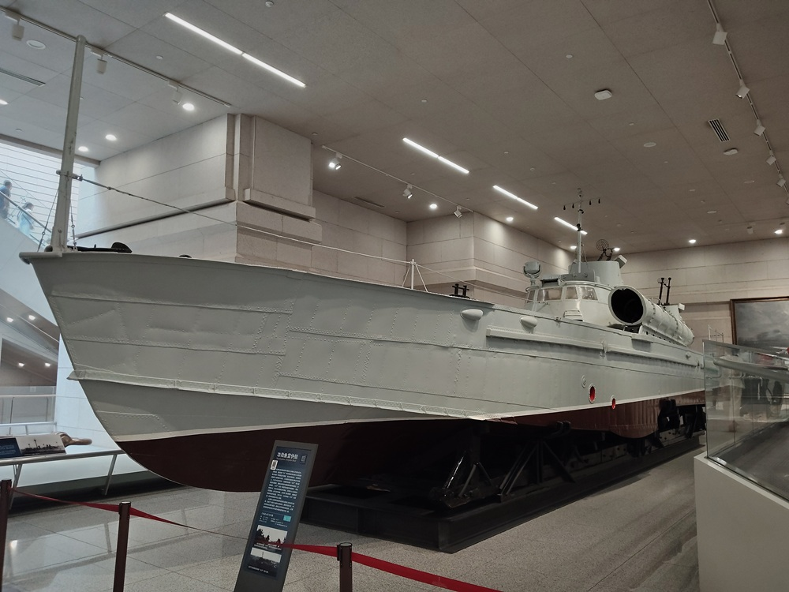
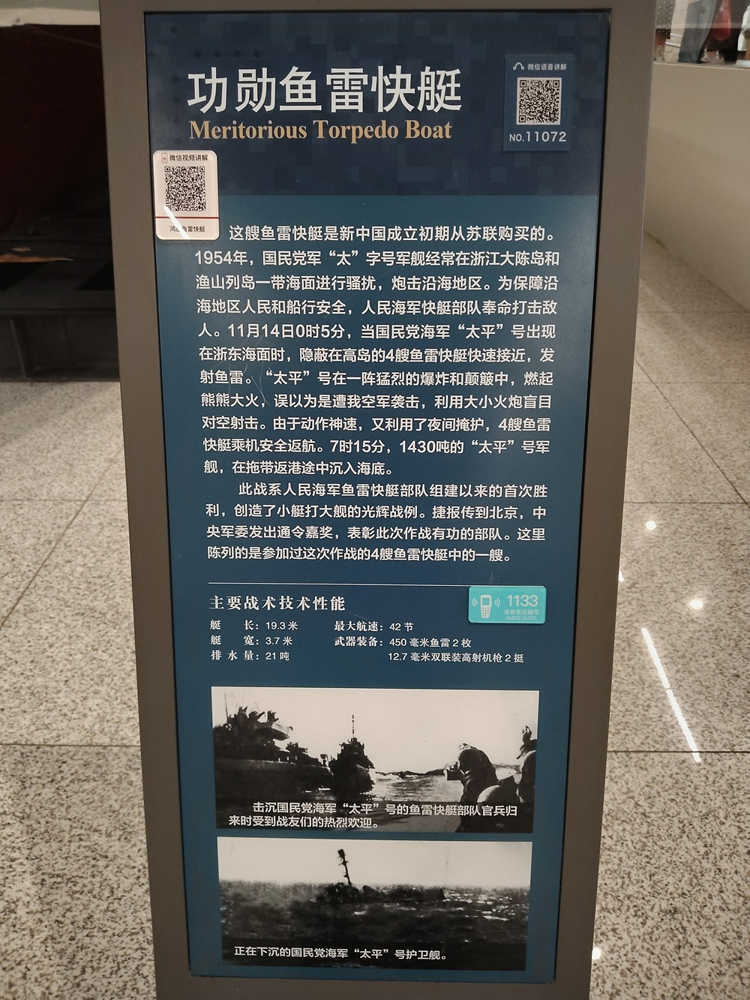

# 功勋鱼雷快艇

这艘鱼雷快艇是新中国成立初期从苏联购买的。1954年，国民党军“太”字号军舰经常在浙江大陈岛和渔山列岛一带海面进行骚扰，炮击沿海地区。为保障沿海地区人民和船行安全，人民海军快艇部队奉命打击敌人。11月14日0时5分，当国民党海军“太平”号出现在浙东海面时，隐蔽在高岛的4艘鱼雷快艇快速接近，发射鱼雷。“太平”号在一阵猛烈的爆炸和颠簸中，燃起熊熊大火，误以为是遭我空军袭击，利用大小火炮盲目对空射击。由于动作神速，又利用了夜间掩护，4艘鱼雷快艇乘机安全返航。7时15分，1430吨的“太平”号军舰，在拖带返航途中沉入海底。

此战是人民海军鱼雷快艇部队组建以来的首次胜利，创造了小艇打大舰的光辉战例。捷报传到北京，中央军委发出通令嘉奖，表彰此次作战有功的部队。这里陈列的参加过这次作战的4艘鱼雷快艇中的一艘。

主要战术技术性能：

- 艇长：19.3米
- 艇宽：3.7米
- 最大航速：42节
- 排水量：21吨
- 武器装备：450毫米鱼雷2枚，12.7毫米双联装高射机枪2挺

1954年，人民海军出动4艘排水量仅21吨的鱼雷快艇，于11月14日凌晨出击，击沉了国民党海军1430吨的主力战舰太平号。这一战，是年轻的鱼雷快艇部队在实战中获得的首个战果，创造了小艇打大舰的光辉战例，是我军在收复浙东列岛争夺制海权中的关键一战，中央军委予以通令嘉奖。军博收藏的158艇，就是直接击沉太平号的鱼雷快艇。

## 太平号

太平号是国民党海军的主力战舰，原为美国海军的德克尔号，建造于费城海军船坞，1943年服役。美国依据二战租借法案，提供给蒋介石政府的海军使用，旨在提升中国军队在抗日战争中的作战能力，以更有效地对抗日本侵略者。但是，舰员在美国接受培训后，回国时已经到了1946年，没有赶上抗日战争。

太平舰最初为人所知，是在海军名将林遵的指挥下，参加了1946年收复南海诸岛的行动。为了纪念太平舰，南沙群岛中最大的岛屿被更名为太平岛。

1953年后，国民党军残部以大陈岛为依托，经常向温州湾、三门湾一带海域袭扰，并经常在夜间派出舰艇在大陈岛与渔山岛、大陈岛与一江山岛之间海域游弋。太平舰在浙江海域的活动，严重干扰了当地渔民的日常作业、商业贸易，以及海上运输的正常运行。

## 奉命出击

1954年10月25日，华东军区海军负责人张爱萍下令对太平号发起进攻，给国民党海军予以重创，以夺取大陈列岛附近海域的制海权，为日后登陆大陈列岛提供保障。

之所以选择太平号，基于以下几个关键因素：

- 太平号的巡逻路径是固定的，必须严格遵守预定航线，无法随意调整。航线途经多个岛屿，能够提供理想的伏击环境。
- 太平号的作战能力，主要集中在反潜和防空方面，对舰攻击能力较弱，难以有效应对鱼雷艇的快速突袭。
- 人民空军已经夺取了浙东沿海的制空权，太平号的巡逻只能在夜间行动，有夜袭良机。

部署在北方海港的鱼雷快艇部队，如果从海上南下驰援浙东沿海，必然被国民党军队侦察到。于是，解放军采取了瞒天过海的策略，从青岛通过铁路运输，将鱼雷快艇第31大队1中队的6艘鱼雷快艇，隐蔽调派到浙东沿海前线。

1954年10月31日夜，国民党海军雷达兵在荧光屏上发现了6个小亮点。只见6个小亮点围着高岛锚地海域绕了一圈，便全都按原路返回了。根据经验判定，这是一支解放军护卫舰编队的例行巡航。岂不知，每艘护卫舰的舷侧都拖带着一艘鱼雷艇。由于护卫舰的体积大大超过鱼雷艇，而且编队航向正好垂直于对方的观测站，因此对方雷达只能发现一个小白点并错误地认为只是一艘护卫舰。利用高岛地形的遮蔽，在围着高岛转圈时，护卫舰编队迅速将一艘艘鱼雷艇放下后，隐蔽在高岛埋伏下来，护卫舰继续前进。在敌人的雷达看来，所有舰只全部返回了基地。就这样，6艘鱼雷快艇，出乎意料的在敌人的鼻子尖下埋伏了起来。

## 海战装备

利用从原国民党海军舰艇上拆下的一台SO-8舰用对海雷达，架设了高岛观察通信站。雷达布局充分利用了制高点优势，显著提升了探测范围和精度，实现了对周边海域的有效监控。

敌人差不多每天晚上都要用舰炮轰击我雷达天线，因为白天怕我空军轰炸。雷达天线，安装在靠近山顶。炮打低了，炮弹不是在滩头爆炸，就是在山坡上爆炸。打高了，炮弹又飞到山后面去了。

第31大队1中队的6艘鱼雷快艇，是我国从苏联获得的P-4型高速鱼雷艇（123艇）。P-4型鱼雷艇是苏联提供给我们的旧艇，铝制艇体，排水量21吨而，性能并不十分突出。但依然是人民海军第一型进攻型武器，配合人民海军刺刀见红的战斗作风，也可以说是如虎添翼。

## 夜袭太平号

1954年11月1日，第31大队1中队抵达当晚，雷达即发现目标，但敌舰提前返航，攻击未果。12日下午1时左右，3分队由于没有注意到潮汐变化，2艘快艇搁浅，螺旋桨受损，不得不拖回定海修理。当日2分队抵达高岛接替3分队。13日晚，雷达又发现目标，鱼雷快艇当即出击，但很快海上气象变坏，鱼雷快艇不得不返航。按计划，15日鱼雷快艇部队必须返回舟山，因为大风浪季节即将来临。机会就在14日凌晨来到了。

11月14日0时5分，高岛观察通信站发现目标，指挥所判明是台湾海军太字号军舰。第31大队1中队4艘鱼雷快艇进入一级战备。0时52分，1中队开始接敌。1时26分，155艇发现右前方灯光一闪，快艇向闪光方向加速前进。

1时28分，1中队确认目标为太平号，155艇上的海上指挥部立即向岸上指挥部报告，并通报各艇组成左梯队接敌，以155、156艇主攻，157、158艇牵制。但这一战术没有奏效。155艇为了避免妨碍其他艇的动作，向右转向避让，156艇则为取得一定的提前角向左转。这样，主攻两艇的距离迅速拉大，负责牵制的157和158艇则插入其间，形成了一个松散的单横阵。

约在1时30分左右，太平号上的雷达发现4个快速目标。望远镜搜索，看见少许白浪花，表示鱼雷艇正在加速。太平号上的警戒火炮，开始追瞄第31大队1中队的鱼雷艇。

1时35分30秒，155艇发射2条鱼雷，并释放烟幕、打开消音器，以35节航速撤出战斗。157艇于1时36分20秒，发射2条鱼雷，同时也释放烟幕，高速撤离战斗。156艇于1时36分40秒，发射2条鱼雷。此时，太平号开始射击，发射曳光弹。158艇打开消音器，采取35节高速向敌冲击，大胆接近至仅几百米距离，于1时37分发射2条鱼雷。太平号以火炮向我鱼雷艇射击，当我艇转向后，发现鱼雷命中敌舰，海面上掀起了巨大的水柱和黑烟。右舷舰首被撕开了一个一米见方的大洞，海水开始大量涌入，主机受损，完全丧失了机动能力。7时42分，太平号在高岛东南18海里处沉入大海。

## 历史的背影

随着太平号被击沉，国民党海军再也不敢派出舰艇进入大陈列岛附近海域，从而为解放大陈列岛的一江山岛战役扫清了障碍。太平号成为二战后在海战中被击沉的第一艘驱逐舰以上之战斗舰艇，也是世界战争史上第一艘被鱼雷快艇击沉的主力舰只。

有趣的是，太平号生还的船员们认为，舰艇的编号22，两个数字相加等于4。与死谐音，是不祥之兆。从那时起，台湾军方在给军舰编号时，特意避开所有加起来等于4的舷号组合。

太平号充满了遗憾，本可以作为收复南沙群岛的功臣留在历史中，但最后却作为新中国海军鱼雷快艇部队的首个战果被永远地定格在历史之中。

人民海军鱼雷艇部队行动隐蔽、迅速，鱼雷发射准确，一举击沉太平号，创造了海军鱼雷艇部队首次成功的战例。

当然，作为一支年轻的队伍，也有一些需要总结的经验教训，成为海军鱼雷快艇部队的宝贵财富：

- 在高岛隐蔽待机的时候，由于对于当地海浪潮汐的规律了解不足，导致隐蔽的6艘鱼雷快艇之中有2艘搁浅。当战机出现时，只能有4艘鱼雷快艇出击，减少了进攻的力量。
- 攻击得手之后撤离战场的时候，机械照搬苏军作战条例，释放烟幕，反而在夜间暴露了目标，遭到了对手的炮击。

在今天，鱼雷艇已经逐渐成为边缘化的海战武器，被具有更高作战效率的导弹艇和高速潜艇所替代。

回顾历史，依然能让我们看到百年来历代海军军人努力为国家建设海防的身姿。
