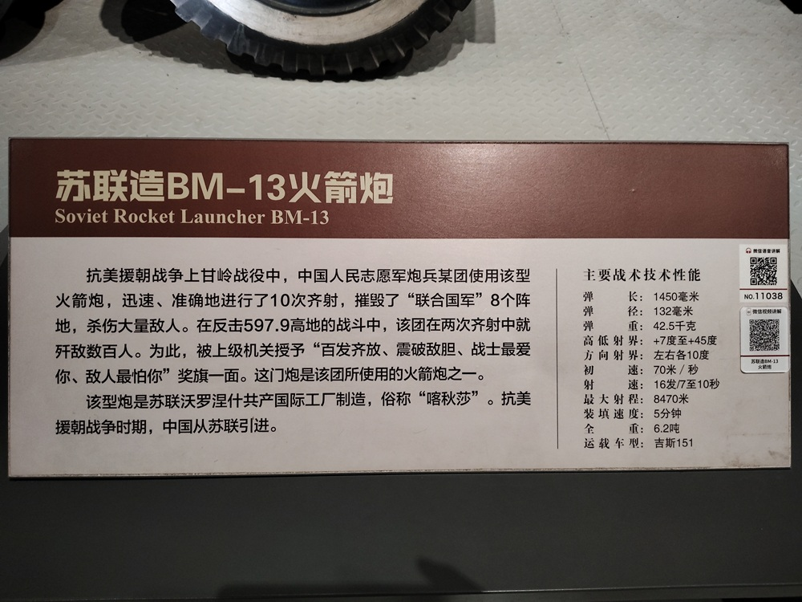

# 苏联造BM-13火箭炮（喀秋莎）

抗美援朝战争上甘岭战役中，中国人民志愿军炮兵某团使用该型火箭炮，迅速、准确地进行了10次齐射，摧毁了“联合国军”8个阵地，杀伤大量敌人。在反击597.9高地的战斗中，该团在两次齐射中就歼敌数百人。为此，被上级机关授予“百发齐放、震破敌胆、战士最爱你、敌人最怕你”奖旗一面。这门炮是该团使用的火箭炮之一。

该型炮是苏联沃罗涅什共产国际制造，俗称“喀秋莎”。抗美援朝时期，中国从苏联引进。

主要战术技术性能：

- 弹长：1450毫米
- 弹径：132毫米
- 弹重：42.5千克
- 高低射界：+7度至+45度
- 方向射界：左右各10度
- 初速：70米/秒
- 射速：16发/7至10秒
- 最大射程：8470米
- 装填速度：5分钟
- 全重：6.2吨
- 运载车型：吉斯151

世界上第一门现代火箭炮，是1933年苏联研制成功的。苏联沃罗涅什共产国际制造的BM-13型火箭炮，俗称喀秋莎。抗美援朝时期，中国从苏联引进。由于战功卓著，被上级机关授予“百发齐放、震破敌胆、战士最爱你、敌人最怕你”奖旗一面。

## BM-13火箭炮

BM-13型自行式火箭炮，安装在载重汽车的底盘上，装有轨式定向器，可联装16枚132毫米尾翼火箭弹。最大射程约8500米，最大行程385千米。1939年正式装备苏联红军，在整个二战期间，总共装备6800门。

BM-13型火箭炮，由汽车部分和发射部分组成。发射部分由滑轨床、炮架、回转盘、底架、瞄准装置、发射装置等组成，发射架拥有左右各90度的方向射界。在发射前，火箭弹是用定向钮，钳在滑轨槽的定向沟内。火箭弹是固体燃料火箭弹，战斗部分的弹体内是TNT炸药，药筒部分是由七根管状发射药筒组成。

火箭炮的汽车底盘后部，有2个手动的千斤顶。发射火箭弹时，炮手要将千斤顶放下固定，以保证发射平台的稳定性。发射装置位于驾驶室中，由炮长操作。也可以通过电线连接，由火箭炮连统一发射。

苏联军方的测试结果表明，BМ-13火箭炮特别适合打击暴露、密集的敌有生力量集结地、野战工事及集群坦克火炮。

BМ-13火箭炮是车载自行火炮，因此适合打击突然出现的敌军，以及与对方进行炮战。不过由于火箭炮发射时，烟尘火光特别明显，而且完全没有防护，因此不适合在敌炮火威胁比较大的地域里作战。

## 第二次世界大战

1941年6月28日，苏联编成了BM-13火箭炮的第一支作战部队。莫斯科军区的7辆发射车被编为独立实验部队。在斯摩棱斯克的奥尔沙地区，首次参加实战。作战中，7门BM-13型火箭炮速射112枚火箭弹，猛烈轰击德军刚刚占领的火车站，杀伤、摧毁德军大量人员和物资。不仅消灭了德军大量有生力量和军事装备，而且在德军精神上产生了巨大的震撼。

为了保密，当时苏联红军未给火箭炮定名，但在发射架上标有表示沃罗涅日“共产国际”兵工厂的“K”字。可能由于这个原因，苏联红军战士便把这威力巨大的新式武器亲切地称之为“卡秋莎”。

第二次世界大战结束时，苏军已拥有7个火箭炮师，11个火箭炮旅以及38个独立火箭炮营，一大半的火箭炮都是BМ-13火箭炮。苏联红军的火箭炮部队已经成为整个炮兵中最具威力的部分。

## 抗美援朝

1951年9月1日，是中国人民志愿军喀秋莎火箭炮的首战日。第203火箭炮团的24门喀秋莎，对位于后洞里的美军部队实施了覆盖性炮击。

在1952年的上甘岭战役中，志愿军炮兵某团使用喀秋莎火箭炮，迅速、准确地进行了10次齐射，摧毁了联合国军8个阵地，杀伤大量敌人。在反击597.9高地的战斗中，两次齐射就歼敌数百人。为此，被上级机关授予“百发齐放、震破敌胆、战士最爱你、敌人最怕你”奖旗一面。

1953年夏，志愿军在金城以南地区，发起了朝鲜战争中最后一次进攻战役，这就是“金城战役”。

1953年7月13日21时，志愿军集中了1094门火炮对敌军实施猛烈攻击，其中包括5个火箭炮团，拥有近200门喀秋莎火箭炮。喀秋莎火箭炮火力猛、射速快的优越性再次显露出来。在10秒之内，约3000枚火箭弹射向敌方，形成一片火海，取得了良好的火力突击效果。志愿军官兵在1小时内，就全线突破了敌军阵地，迅速取得了此次战役的胜利。为尽快签署朝鲜停战协定赢得了时间，从而结束了近3年的朝鲜战争。

## 苏联经典歌曲

正当梨花开遍了天涯，河上飘着柔曼的轻纱。

喀秋莎站在那峻峭的岸上，歌声好像明媚的春光。

喀秋莎，由民谣歌手丽基雅·鲁斯兰诺娃首次演唱，马特维·勃兰切尔作曲，米哈伊尔·伊萨科夫斯基作词，是一首二战时苏联经典歌曲。

歌曲在创作之初并没有流行，两年后的苏联卫国战争，使《喀秋莎》脱颖而出，并伴随着隆隆的炮火流传开来。战争使《喀秋莎》体现出了不同寻常的价值，经过战火的洗礼，更是获得了新的甚至是永恒的生命。

战后，苏联为了表彰《喀秋莎》在战争中所起到的巨大鼓舞作用，专门建立了一座纪念馆。