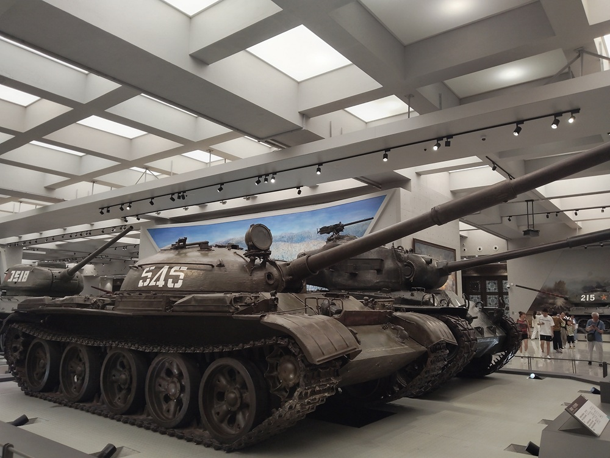
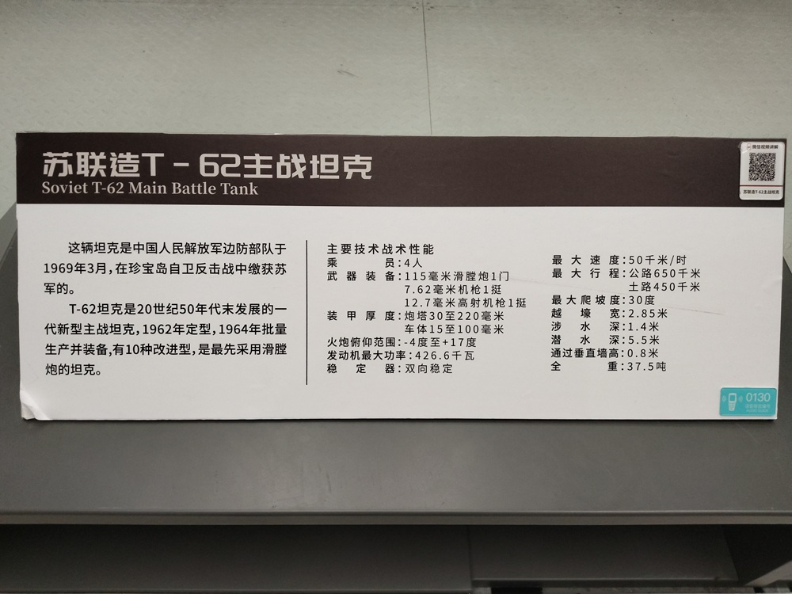

# 苏联造T-62中型坦克

这辆坦克是中国人民解放军边防部队于1969年3月，在珍宝岛自卫反击战中缴获苏军的。

T-62坦克是20世纪50年代末发展的一代新型主战坦克，1962年定型，1964年批量生产并装备，有10种改进型，是最先采用滑膛炮的坦克。

主要战术技术性能：

- 乘员：4人
- 武器装备：115毫米滑膛炮1门  7.62毫米机枪1挺  12.7毫米高射机枪1挺
- 装甲厚度：炮塔30至220毫米  车体15至100毫米
- 火炮俯仰范围：-4度至+17度
- 发动机最大功率：426.6千瓦
- 稳定器：双向稳定
- 最大速度：50千米/时
- 最大行程：公路650千米  土路450千米
- 最大爬坡度：30度
- 越壕宽：2.85米
- 涉水深：1.4米
- 通过垂直墙高：0.8米
- 全重：37.5吨

我国的坦克，从69式到79式，再到99式，多少都能找到一点儿T-62的影子。1969年，中苏激战珍宝岛，我军缴获了被炸断履带的T-62坦克。不但拿到了苏军入侵的证据，获得了全世界的同情与支持，也通过深入学习分析，让国防科技水平实现了明显进步。

## 中苏关系破裂

1960年代，中国不接受成为苏联的附庸，中苏关系破裂。在两国边境，苏联不断制造摩擦，克格勃领导的边防军频繁对正常作业的中国边民施暴，尤其是在乌苏里江中方一侧珍宝岛。1969年3月，苏联太平洋边防军区第57、69边防总队，企图武力清除中国边防军和渔民。3月2日，遭苏军武力挑衅后被迫还击，我国完全控制珍宝岛。

## 冰面埋雷

由于之前和苏军BTR-60PB装甲车较量过，我方预料苏军下一步会采取坦克突击。对付坦克最好的办法，就是埋地雷。履带是坦克最重要，也最容易被炸毁的部位。只要炸毁了履带，坦克就变成了进退两难的铁疙瘩，不能再造成太大的伤害。

珍宝岛地处乌苏里江上，没办法把地雷埋到江面上。就算钻个洞，把地雷埋进去，雪白的江面也会直接把地雷的位置暴露出来。这样，地雷就失去了作用，毕竟苏联人也不是傻子，看见地雷还往上冲。另外，苏联大量汲取了二战期间坦克作战的经验，肯定会提前准备，避开地雷阵。

事已至此，只能放手一搏。既然地雷是黑色的，那就罩上一层白布，解决地雷容易暴露的问题。战士们说干就干，开始用白布制作口袋，先把地雷装进去再埋进雪里。果然很奏效，茫茫江面上只能看到一个个的雪堆，却没有地雷的身影。

结合岛上的地理环境，在重要通道布设了地雷，同时也安排了隐蔽的射击阵地。

## 炸瘫T-62坦克

几天零星交火后，苏军将二线正规军加强给边防军，于1969年3月15日组织了最猛烈的进攻。在3月2日吃过亏的苏联第57边防总队长德莫克拉特·弗拉基米罗维奇·列昂诺夫上校，亲自跳上一辆编号545的T-62坦克，率另外两辆坦克从西面狭窄的河汊（chà）逼近珍宝岛，试图从南翼包抄解放军。

选择这个方向，是因为坦克能沿结冰的河汊插入解放军后方。列昂诺夫本人曾在过去几个月里对峙时上过岛，自认为熟悉地形，试图用坦克实施穿透，迅速动摇中国人的斗志。

列昂诺夫自认为得计，却犯下致命错误。他不清楚岛上有多少人，也不清楚在什么地方埋伏了反坦克武器。新加强来的苏联坦克兵全是义务兵，技艺并不纯熟。而且还是头一回参战，连坦克电台都忘记和掩护的步兵分队调到同一频率。

苏军坦克出现后，解放军立即用无后坐力炮和火箭筒攻击。这本是概略性袭扰射击，但由战斗英雄杨林指挥的炮班打出的炮弹，奇迹般地在545号车炮塔左侧下方打出缺口。545号车组慌忙向岛西南方转移，在离岛约400米的河汊冰面上触雷，左侧履带被炸断。车组从车底安全门弃车逃离，其中列昂诺夫与545号车驾驶员库兹明被击毙，其余两辆坦克慌忙南撤。

## 争夺T-62坦克

时任苏联国防部长的格列奇科元帅，向勃列日涅夫报告战况，提到了有1辆T-62中型坦克被打瘫在珍宝岛的江汊上。勃列日涅夫下令，无论如何都要把坦克弄回来，特别强调不能拖，必须尽快搞定，实在弄不回来就炸沉到江底。苏联不想留下入侵中国的证据，也不想将让中国研究T-62坦克上的新技术。

周总理听到消息，立刻发了急电，命令前线部队无论如何也要保住T-62坦克。沈阳军区迅速组成代号62小组的坦克抢救分队，前往珍宝岛。

我军炮兵部队早已在周边区域构建了严密的火力封锁线，所有火力点都经过周密规划，重点封堵了敌方可能展开救援行动的通道。尽管苏联军队反复发起突击，试图撕开这道防线，但在我强大火力压制和有利的地形优势下，苏军的每次进攻都被成功击退。

3月28日凌晨4时，62小组乘铁路闷罐车到达乌苏里江西侧的东方红车站，29日下午乘坐卡车到达江边的前线指挥部。为了在困难条件下搬运和吊装，部队从哈尔滨运来了大功率绞车和起重机械等专门的重型装备。自来水公司和北海舰队的潜水员，负责水下工作。

双方都要争夺T-62坦克，双方火力封锁严密，都无法大张旗鼓的接近坦克，只能是侦察兵在夜间活动。苏军多次硬抢不奏效，决定将545号车爆破炸毁。从3月30日起，先后两次爆破，每次都是把炸药放在坦克下面而不是坦克内部，爆炸冲击波仅把坦克炸得跳几下。苏军后来从乌苏里斯克调来几门240毫米重型迫击炮，对T-62所在江面反复射击，试图炸开冰面，让坦克沉入水下。

面对苏军火炮的干扰，62小组让4辆拖拉机两两对开，制造耕作的假象，掩盖拖拉坦克发出的声音。在岛上，工程师和专家们使用了伪装网和烟雾弹，以此来降低在操作时被苏军发现和袭击的可能性。经过多日的不懈奋斗，T-62坦克终于平稳地从水中被吊起。

打捞出水的T-62坦克很快就被送到北京展出，以此向国内外证明珍宝岛事件真相，证明苏军侵略我国的事实，我国也由此获得了全世界的同情与支持。

在T-62坦克调运过程中，苏联的秘密情报组织克格勃，试图派中国籍间谍制造混乱。没想到还没开始行动，间谍就被我边防官兵控制。

## 启蒙老师T-62

当年33岁的熊克芳，正在研究坦克发动机系统，是62小组中唯一的女同志。领导特别叮嘱要严格保密，不能将行动的消息透露给任何人，包括家人。为了完成任务，熊克芳同志把儿子托付给了一位亲戚，只说是到北京出差。

到了前线指挥部，才知道主要任务是现场观察T-62坦克发动机的大致构造，冷却系统多了什么东西。T-62坦克是苏联的新一代坦克，其发动机比59式坦克多了60马力，意味着发动机会产生更高的热量，而苏联专家采用了什么样的新型冷却系统，是我们想不通的。熊克芳同志用手仔细摸了两遍发动机外表面，与印象中的59式坦克发动机外表面作了对比，感觉也没有什么差别。

在军方研究基地，通过分解和试验相结合的方式，终于弄清楚了T-62坦克增加60马力的冷却散热技术。T-62坦克的水散热器与59式的大小相同，内部却采用了管带式，59式坦克是管片式。管带式的优势，是可以增加水散热器的空气流通量。这种改动，用手是摸不出来的。

专业技术人员和工程师们对坦克的每个部分都进行了仔细钻研和全面检测，从动力系统到射击控制系统无一遗漏。同时，研究团队还对坦克的防护装甲、炮塔转动装置以及内部驾驶空间设计展开了细致的考察。

T-62坦克采用了大量先进技术，率先使用115mm大口径滑膛炮，开创了20世纪60年代坦克火炮使用滑膛技术的先河。坦克安装了先进的火炮双向稳定器，同时还安装了大功率发动机，弹架油箱设计别具一格。车身采用了低火线和驾驶后座下调等技术，从而保证车重和车体积满足火力的需要。T-62坦克的火控系统也作了改变，性能同样有显著提高，如激光测距仪、红外瞄准镜和昼间瞄准镜。稳定的火控系统能够降低车体对火炮的干扰，尤其是在坦克行进或停车期间，火炮的命中率得到了大幅度提升。

我国根据这些新技术，开发出了性能更好的红外夜视仪、大功率柴油机和双向稳定器等设备。值得一提的是，T-62坦克改变了我们对主战坦克的认知，既具备中型坦克的灵活，也具备重型坦克的火力。不久之后，我国装甲部队就装备了更为先进的69式坦克。

珍宝岛一战证明，当时中国军队装备的主要反坦克武器，无法有效地击穿T-62坦克的正面装甲。我国组织了大规模的反坦克武器会战，促进了中国坦克和反坦克技术的大发展，产生了丰硕的成果。

如今，T-62坦克陈列在军事博物馆内，只是很少有人知道隐藏在背后的秘密。