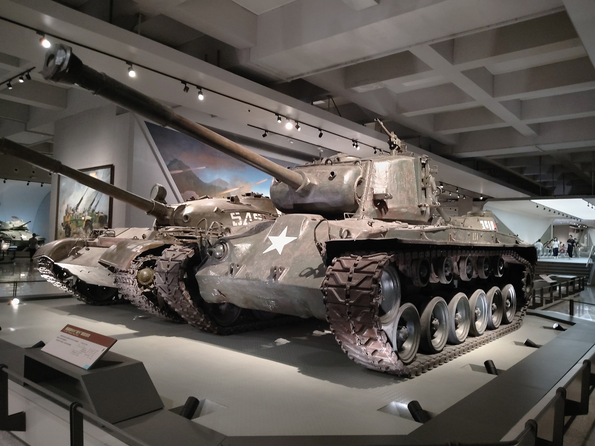
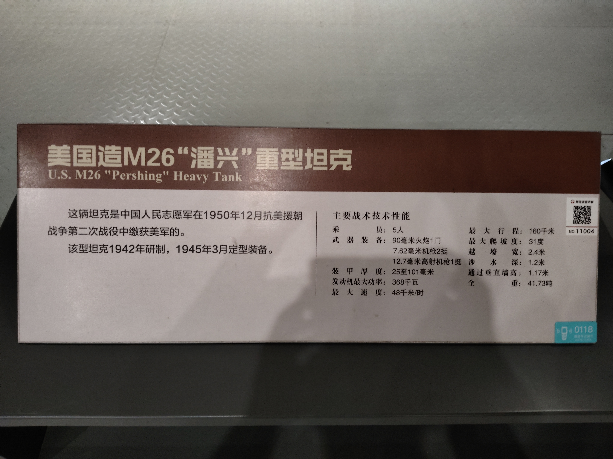

# 美国造M26潘兴重型坦克

这辆坦克是中国人民志愿军在1950年12月抗美援朝战争第二次战役中缴获美军的。

该型坦克1942年研制，1945年3月定型装备。

主要战术技术性能：

- 乘员：5人
- 武器装备：90毫米火炮1门  7.62毫米机枪1挺  12.7毫米高射机枪1挺
- 装甲厚度：25至101毫米
- 发动机最大功率：368千瓦
- 最大速度：48千米/时
- 最大行程：160千米
- 最大爬坡度：31度
- 越壕宽：2.4米
- 涉水深：1.2米
- 通过垂直墙高：1.17米
- 全重：41.73吨

二战期间，M26潘兴重型坦克在欧洲战场不可一世，与德军坦克多次交锋都占据上风。抗美援朝的第二次战役，志愿军共歼敌3.6万人，其中美军2.4万余人，缴获联合国军坦克和装甲车200余辆，其中就包括M26潘兴重型坦克。

## M26潘兴重型坦克

M26重型坦克为传统的炮塔式坦克，车内由前至后分为驾驶室、战斗室和发动机室。该车有乘员5人：车长、炮手、装填手、驾驶员和副驾驶员。

M26重型坦克的车体为焊接结构，其侧面、顶部和底部都是轧制钢板的，而前面、后面及炮塔则是铸造的。车内设有专用加温器，供驾驶室和战斗室的乘员取暖。

M26重型坦克有一挺12.7毫米高射机枪和2挺7.62毫米机枪，其中一挺是并列机枪，另一挺是前机枪。主炮是美军90毫米高射炮的改型型号，方向射界为360度，炮塔旋转360°需17秒，高低射界为-10度到+20度。德国“虎王”的炮塔在液压驱动下旋转360°需要19秒，火炮俯仰角度范围为-8°~+17°。

## 为二战而生

二战期间，德国虎式重型坦克是二战中的著名坦克，在战场中击毁了大量的敌军坦克和其它的火炮。美国曾以M4中型坦克的数量优势来对付德国坦克的质量优势，但德军虎式重型坦克，凭借着厚实装甲以及大口径火炮，全面压制美军的M4中型坦克。

从1942年开始，美国根据战场需求，开始研制新型重型坦克。采用新型T7式90毫米火炮的T26E3坦克样车，在欧洲战场通过了实战的考验。1945年1月定型生产，正式定名为M26重型坦克，同时以美国名将约翰·约瑟夫·潘兴将军命名。

M26重型坦克在二战期间生产了1436辆，随后至1945年底又制造992辆，总共生产了2428辆。

在二战欧洲战场，M26重型坦克由于坦克火力强、机动性好、装甲厚重，因而与德军坦克的多次交锋中占据上风，证明了强大的作战能力。

## 投入朝鲜战场

虽然由于投入战场较晚，M26重型坦克没有来得及在二战战场上发挥决定胜负的作用，但在1950年的朝鲜战争中大量使用。

在朝鲜战争中，美军使用M26重型坦克组成的环形防御，成功的抵挡了朝鲜军队的T-34/85坦克。因为90毫米火炮的优异表现，美军戏称T-34/85为“鱼子酱罐头”，意为击毁T-34/85坦克和开鱼子酱罐头一样容易。

在与志愿军作战中，M26重型坦克经常开到志愿军防守的山地前，为美军提供火力支援，体现了其良好的地形适应能力。

1950年10月31日，由美国陆军第70坦克营支援的第8骑兵团遭到120毫米迫击炮和132毫米“卡秋莎”火箭炮的攻击。午夜，志愿军的115师和116师对该发动了大规模的步兵攻击，歼灭了10辆M26重型坦克，3辆M4A3E8中型坦克，1辆M32A1修理车和近1个步兵营。

## 第二次战役

第一次战役失利的美军，并没有放弃进军鸭绿江，占领朝鲜边境的企图，美国政府依旧坚持以军事进攻迅速占领全朝鲜的计划。

彭德怀元帅判断联合国军可能重新组织进攻，提出了巩固胜利、克服当前困难、准备再战的方针，如敌再进，让其深入后歼击之。1950年11月5日，毛泽东主席同意彭德怀提出的作战方针。

联合国军总司令D.麦克阿瑟认为，中国只是出动了小规模的兵力象征性地参战。因此，他调整部署，决定在朝鲜战场发动总攻势，计划先以地面部队进行试探性进攻，然后向北发起总攻，在圣诞节（1950年12月25日）前结束朝鲜战争。

1950年11月6日，联合国军开始试探性进攻。志愿军按预定计划以部分兵力节节抗击，诱敌深入，主力向后转移。在志愿军的迷惑下，联合国军全线北进，至21日被志愿军诱入预定战场。

第二次战役，中国人民志愿军和朝鲜人民军彻底粉碎了联合国军占领全朝鲜的企图，解放了朝鲜北半部除襄阳外的全部地区，将战线推至三八线，并占领三八线以南瓮津半岛和延安半岛，迫使联合国军由进攻转入防御，从根本上扭转了朝鲜战局。

在作战中，志愿军共歼敌3.6万人，其中美军2.4万余人，缴获“联合国军”坦克和装甲车200余辆，其中就包括M26“潘兴”重型坦克。此外，缴获与击毁各种炮1000余门、汽车3000余辆、缴获飞机6架。美军第8集团军司令W.H.沃克，也在撤退中身亡。

## 名将潘兴

潘兴是美国军事家，是美军唯一一位陆军特级上将，绰号铁锤将军、黑桃杰克。

第一次世界大战，双方斗得筋疲力尽之时，潘兴率美军进入欧洲，作为有生力量帮助英法军队打败德军。潘兴不急于投入战斗，而是认真地进行战前训练。在堑壕里苦战的英国人和法国人，急得不得了。潘兴的参谋也提醒他：“德国人说，在英法军队垮台之前，美军到不了前线！我们的训练计划需要这么长的时间，是不是会让人觉得德国人说的对。”潘兴说：“我不知道德国人的想法，我只知道没有受过训练的士兵打不了仗！”

英法原来打算只将美军作为加强力量使用，不给其独立指挥权，只让美国扮演配角。在一次联军会议上，潘兴当着英国首相劳合·乔治和法国总理克里孟梭的面，申明美军必须有独立的作战方向，自己必须独立地指挥美军作战。说完，拂袖而去。在他的积极争取下，英法只得同意美军保持战场上的独立性。

潘兴的战略意识换取的独立作战指挥地位，为一战后美国在国际事务中建立自身的军事地位奠定了坚实的基础。

早年间，有一次急行军到达目的地之后，大家累的顾不上擦皮鞋，就休息了。潘兴看到后，非常生气，就批评值日军官，命令大家立即起来擦皮鞋。潘兴一眼看到巴顿的皮鞋锃明瓦亮，就说照着他这样做，他怎么擦的，你们就怎么擦。

潘兴还是个上尉的时候，西奥多·罗斯福总统想把他提升为少校或中校。当罗斯福总统发现美国法律不允许这样做时，索性利用总统职权，将他直接升为准将。这在美国历史上是绝无仅有。1919年9月，潘兴被授予陆军特级上将（General of the Armies），并且此军衔不再授予潘兴以外的任何人。