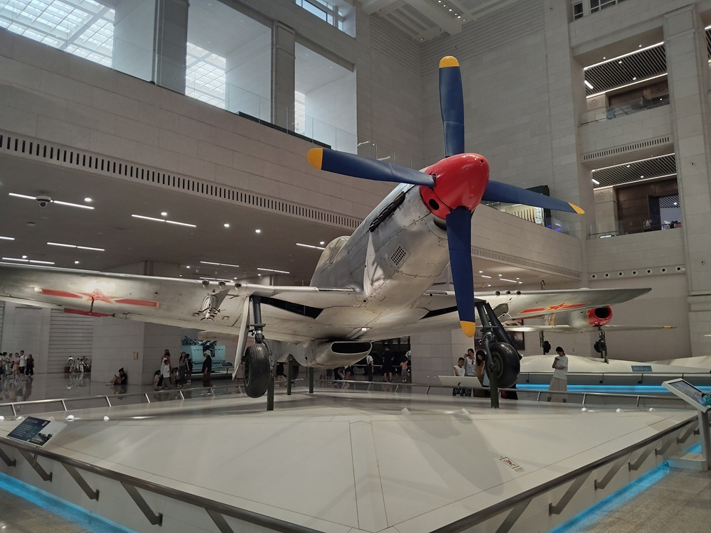
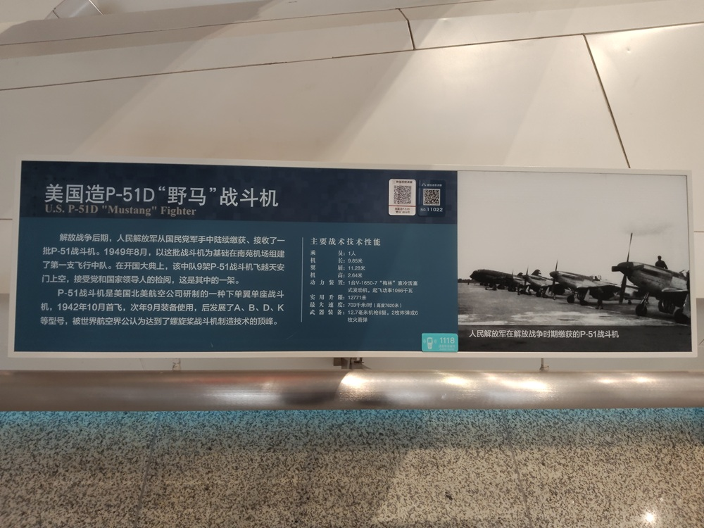

# 美国造P-51D野马战斗机

解放战争后期，人民解放军从国民党军手中陆续缴获、接收了一批P-51战斗机。1949年8月，以这批战斗机为基础在南苑机场组建了第一支飞行中队。在开国大典上，该中队9架P-51战斗机飞越天安门上空，接受党和国家领导人的检阅，这是其中的一架。

P-51战斗机是美国航空公司研制的一种下单翼单座战斗机，1942年10月首飞，次年9月装备使用，后发展了A、B、D、K等型号，被世界航空界公认为达到了螺旋桨战斗机制造技术的顶峰。

主要战术技术性能：

- 乘员：1人
- 机长：9.85米
- 翼展：11.28米
- 机高：2.64米
- 动力装置：1台V-1650-7液冷活塞式发动机，起飞功率1066千瓦
- 实用升限：12771米
- 最大速度：703千米/时（高度7620米）
- 武器装备：12.7毫米机枪6挺，2枚炸弹或6枚火箭弹

人民空军正式建立之前，以P-51野马战斗机为基础，在南苑机场组建了我军第一支飞行中队。开国大典上，南苑飞行中队的9架P-51野马战斗机，两次飞越天安门上空，接受了党和人民的检阅。军博陈列的P-51D野马战斗机，就是其中的一架。

## P-51D野马战斗机

今天的人们可能不太熟悉，P-51野马战斗机达到了螺旋桨战斗机制造技术的顶峰，是世界航空界公认的。

1940年，经过120天的研制，美国北美飞机制造公司，为英国研制了一种新型战斗机。新机服役编号定为P-51，英国人取名为野马。在第二次世界大战中，P-51野马战斗机立下了显赫的战功，被誉为歼击机之王。

P-51野马战斗机，是单翼单座单发平直翼活塞式战斗机，采用先进的层流翼型。高度简洁的机身设计，合理的机内设备布局，使气动阻力大大下降，并且在尺寸和重量与同类飞机相当的情况下，载油量增加了3倍。

抗日战争胜利后，国民党政府从美国购买了大量的P-51战斗机。解放战争后期，解放军陆续缴获、接收了一批P-51战斗机。

## 南苑飞行中队

1949年8月15日，为了对付国民党军队的空袭，加强北平地区的要地防空力量，在北平南苑机场成立了飞行中队。

南苑飞行中队是人民解放军的第一个飞行中队，也是第一支空军部队。P-51野马战斗机，是南苑飞行中队的主力战机。

飞行中队成立后，参加的第一件具有重大历史意义的工作，就是开国大典上的空中受阅。阅兵计划中，原来没有空军飞行部队参加，只有几架运输机到会场上空散发传单。9月中旬，中央决定阅兵时除地面部队外，空军也要参加。

这是中国第一次空中受阅，过去国民党空军也没有搞过，而且时间已经十分紧迫。

当时的飞机装备，几乎全是来自缴获或者起义的飞机。飞机型号多种多样，高的高、低的低，快的快、慢的慢。就是同一类型飞机，速度也不一样。飞机又破又旧，都是经地勤人员日日夜夜抢修好的。飞行员们来自全国各地，语言不同、飞行习惯、空中应对方式都彼此不熟悉，空中联络也是个问题。

聂荣臻是开国大典阅兵总指挥，在听取了军委航空局的详细汇报后，再次强调：空中受阅与地面受阅不同，难度大，影响也大，一定要搞好，你们要抓紧时间，周密计划，确保万无一失。

参加阅兵飞行的飞行员都做了阅兵宣誓：“我参加检阅，一旦飞机出现故障，宁愿献出生命，也不让飞机落在城内、掉在广场和附近的建筑物上。”

## 飞行训练

南苑飞行中队拟订了20天的飞行训练计划，以及多机种使用南苑机场一条跑道的日程安排，飞行训练重点是编队课目。为了做到确有把握，毛主席批准了先在天安门上空试飞几次的请示。

当时，北平正在召开第一届新的政治协商会议，飞行中队的责任非常重大。每天拂晓就有十多架战斗机，进行试车检查，很远就能听到发动机巨大的轰鸣声。北平城内风传共产党调来大批空军，驻扎在南苑机场。传闻的数字先是几十架，以后又变成了上百架。敌人也一时弄不清虚实，起到了威慑的作用。

有一次，轰隆隆的飞机引擎声，让政协代表们有点儿坐不住，开始交头接耳，以为是国民党军飞机来空袭。周总理笑着告诉大家：“这是我们自己的飞机，他们在保卫我们的政协会议。同时他们也是在训练，为开国大典的空中受阅做准备。”顿时，一阵欢呼声盖住了周恩来总理的声音，代表们热烈地鼓起掌来。

## 飞行高度

阅兵式的空中编队，采用什么高度比较合适呢？高了，看不清。低了，一方面声音干扰大，另一方面是飞机速度快，转眼就飞过去看不见了。

飞行高度是个十分专业的问题，谁也没有经验。

在8月的一天，军委航空局局长常乾坤带着两个飞行员，到聂荣臻办公室汇报工作，“偶遇”了一位苏联空军将军。工作结束后，聂荣臻对常乾坤他们说：“你们留下来，陪苏联空军将军吃烤鸭。”

席间，常乾坤适时问道：“聂总，我想请示一下，飞过天安门时，飞行高度怎么确定？”聂荣臻一边吃着饭，一边头也不抬地指了下苏联将军：“这个问题，你问他。”

苏联将军正吃着高兴，立即接过来话说：“要根据各型飞机的下滑率，来确定飞行高度，飞机能够滑翔到不伤害人的地方就行。”就这样，一个专业难题迎刃而解。

## 带弹飞行

除了空中受阅任务，南苑飞行中队还担负着保卫北平的要地防空任务。开国大典前两天，有4位飞行员分头接到秘密通知：为防止受阅时敌机的袭扰，要带弹参加受阅，随时准备从空中受阅转入反空袭作战。

至于哪架飞机上装有武器弹药，只有飞行员本人知道，方阵里的其他飞行员都不知道。

执行带弹空中受阅任务的4位飞行员，都是驾机起义的国民党空军飞行员。阎磊是其中一位飞行员，几十年后回忆时，说出了当年没有说出的肺腑之言：作为刚刚起义过来的飞行员就参加带弹飞行，充分体现了党和人民，对起义人员的极大信任。

## 两次飞越天安门

参加受阅的飞机共17架，编成6个分队，形成一个跟进队形通过天安门上空。9架P-51野马战斗机编为三个品字形的1、2、3分队；2架蚊式轰炸机编为一字形的4分队；3架C-46运输机编为品字形的5分队；1架L-5通信机与2架PT-19教练机合编为品字形的6分队。

周总理提出意见：“17架飞机，显得有些少了。”飞机的确有些少，而且飞机又不可能慢动作飞行。飞过天安门上空，会让人觉得忽地一下就没有了。但是其他仅有的几架飞机还有战备任务，实在没办法再增加飞机。

这时，周总理帮着出了个主意：“能不能让领队的战斗机，通过天安门后，再飞回来，接在最后面的教练机后面，再飞一遍？”

10月1日下午，受阅的1、2、3分队9架P-51野马战斗机，刚刚通过天安门上空，飞行员随即加大速度，在复兴门上空作右后方转弯。沿西直门、德胜门、安定门、东直门、朝阳门，再转向建国门。当到达东单上空时，正好与6分队的教练机相衔接。9架P-51野马战斗机，再一次通过了天安门上空。由于衔接得天衣无缝，所以在地面上观看的群众，都以为受阅的飞机是26架。

当晚，朱德总司令在北京饭店宴请受阅代表，飞行员们连飞行服也顾上换，就匆匆赶去。总司令来到飞行员们面前说：“你们飞得很好，从现在起，我就是名副其实的陆海空三军总司令了。”