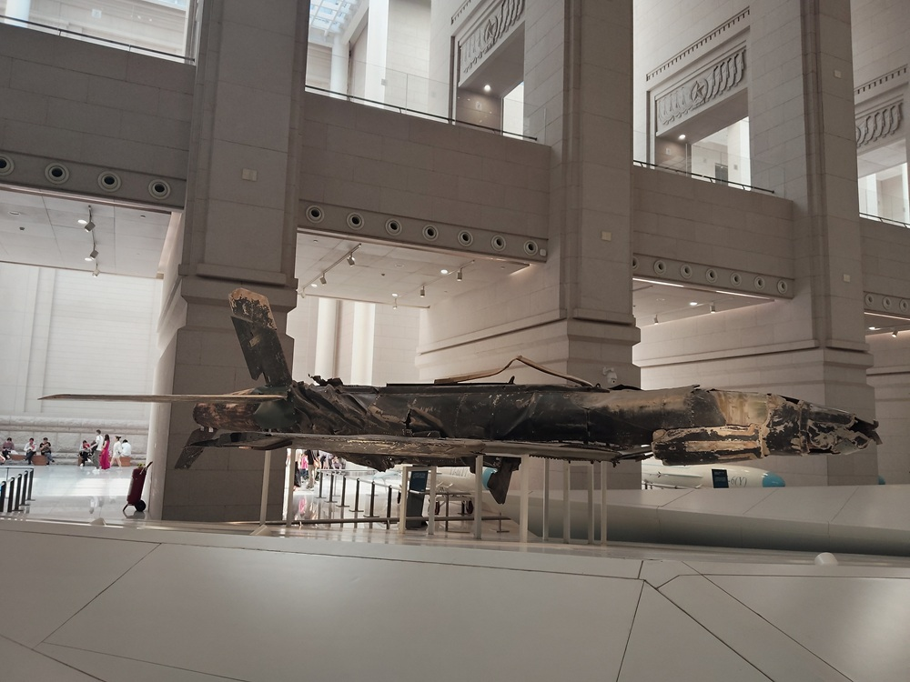
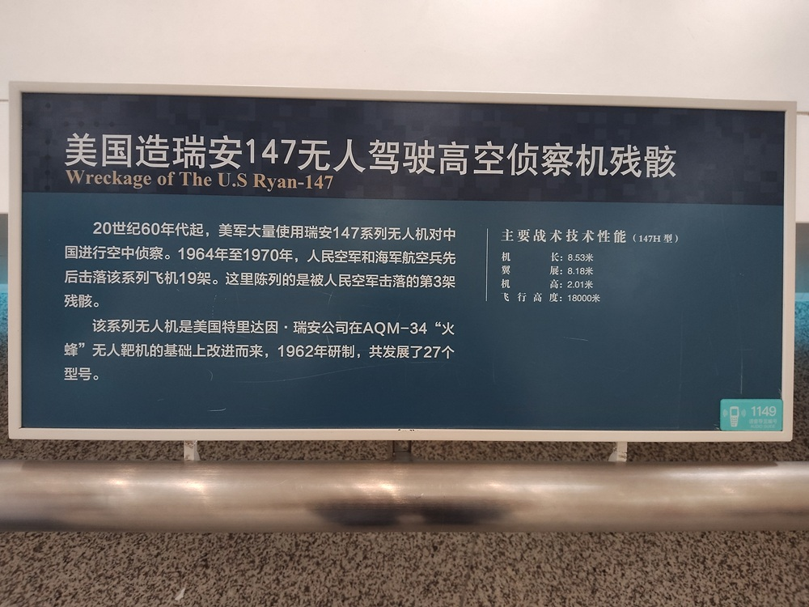

# 美国造BQM-147无人驾驶高空侦察机残骸

20世纪60年代起，美军大量使用BQM-147无人驾驶高空侦察机对中国进行空中侦察。1964年至1970年，人民空军和海军航空兵先后击落该系列飞机19架。这里陈列的是被击落的第3架残骸。

该系列无人机是美国特里达因瑞安公司在AQM-34“火蜂”无人靶机的基础上改进而来，1962年研制，共发展了27个型号。

主要战术技术性能（147H型）：

- 机长：8.53米
- 翼展：8.18米
- 机高：2.01米
- 飞行高度：18000米

20世纪60年代起，美军大量使用BQM-147无人驾驶高空侦察机，对中国进行空中侦察。1964年至1970年，人民空军和海军航空兵先后击落该系列飞机19架。军博陈列的是第3架残骸。

## BQM-147无人侦察机

50年代初，美军开始研制和装备无人侦察机。“火蜂”I型是美陆、海、空三军装备的一种高亚音速无人机，主要用于空中监视、照相侦察、电子对抗等，也可用于对地攻击，海军型称为BQM-34A型。

1951年实现了滑翔试飞，随后进行了带动力试飞。作为一款用来测试其他武器的靶机，需要具备优秀的飞行性能，才能最大限度的检验武器装备的能力。

60年代初，美国在BQM-34A型的基础上，生产了一种新型的无人侦察机，命名为BQM-147G型。BQM-147G无人侦察机，可以通过DC-130运输机进行部署，通过伞降回收后，经过检修可以反复使用，

## 猖獗的侦察活动

1964年8月，美国制造北部湾事件，对北越发动大规模空袭。

1964年8月29日，为掌握我军动向，防止朝鲜战争重演，窃取我国中南和西南地区的军事情报，又为避免有人驾驶侦察机在中国领空侦察时被击落后飞行员被俘，引起外交上的麻烦，开始使用BQM-147G型无人侦察机。

BQM-147由美军运输机，从冲绳携带至南海上空投放。无人机经过海南上空时，被我雷达发现。海南空军随即起飞歼-6战机升空拦截，然而飞行员连无人机的影子都没有看到，只听到一声声BQM-147特有的怪叫声。

首次侦察得手，美军对BQM-147信心倍增，侦察活动愈发猖獗。在之后一个多月里，多次入侵我国领空。我军飞行员数次驾驶歼-6拦截，都一无所获。

1964年10月13日，一架BQM-147从广西闯入，快速飞向雷州半岛。雷达捕获敌机踪迹后，飞行员邹广如从广东遂溪驾驶歼-6升空迎敌。在1.76万米高空，3次锁定无人机开炮，均未击中目标。邹广如决定将敌机撞下来，然而歼-6突然失速进入螺旋坠毁。幸运的是，邹广如成功跳伞。

BQM-147出入我国领空如入无人之境，不但是对我主权的蔑视，更是对我国防安全的重大威胁。

周总理指示：要千方百计打下一架无人驾驶飞机！

## 跃升攻击战法

歼-6坠毁两天后，1964年10月15日，空军司令刘亚楼亲自赶赴广东遂溪，召集指战员商议对策。

歼-6升限17500米，BQM-147升限虽有2万米，但其侦察飞行高度也在17500米左右。理论上，歼-6可以击落BQM-147。

歼-6截击BQM-147屡屡失手，主要是升限射击的问题。17000多米的高空，空气稀薄，升力小，歼-6抖动严重，平飞几秒就会自动掉高。稍不注意，就会失控坠毁，这也是邹广如坠机的原因。

极限高度，对于歼-6几乎是一个禁区。在极限高度，安全飞行都不容易，何况是开炮射击。炮弹强大的后坐力，炮口喷出的瓦斯，都可能导致飞机失速坠毁。另外，在极限高度，飞机反应迟钝，机动性能差，晃动严重，这也增加了击落无人机的难度。

我军最终制定了一套有针对性的“跃升攻击”的战法。所谓跃升攻击，就是飞行员爬升至1.6万多米，开足马力将飞机速度拉满，然后在准确的时机，以正确的角度，突然拉升，使飞机凭借强大的升力和惯性，冲上极限高度。到了一定高度后改平，然后迅速占位、瞄准、射击、脱离。当然，这对飞行员的技术要求很高。

为了早日击落美军无人机，打击美军嚣张气焰，歼-6作战分队的飞行员不畏艰险，反复练习跃升攻击战法。经过一个月的训练和准备，技术上突飞猛进。

## 击落美军无人机

1964年11月15日中午，一架美军BQM-147，以1.76万米的高度，780公里的时速，再次从南海上空闯入我国领空。我军雷达发现无人机后，立即派出一架歼-6前往截击。

飞行员是徐开通，驻遂溪机场的空1师作战分队中队长。按照作战方案，徐开通操作战机爬升至1.62万米高空，然后开足马力将飞机提升至最大速度。据敌机15千米时，徐开通看到了BQM-147的拉烟尾迹。

当和敌机相距3.8千米时，根据地面雷达操作员的指令，徐开通突然操控战机跃升至1.75万米，然后迅速改平飞机，从敌机后下方5度角冲过去。

无人机体积小，距离远就难以击中。两机相距450米时，徐开通才打出第一炮。可惜用力过猛，飞机向左晃动，炮弹偏离目标从敌机左外侧滑过。

徐开通立即修正瞄准，在相距300米时再次发起攻击。由于操作过急，机头未能拉住，炮弹最终从敌机下方穿过。

两次射击未中后，徐开通冒着撞机的危险继续靠近敌机，在距离230米时第三次射击。

BQM-147腹部冒起黑烟，随即变成一团火球。两机此时已近在咫尺，徐开通立即操作战机带左坡度脱离敌机。就在这时，敌机残骸从机身上方几米处一掠而过，场面异常惊险。BQM-147无人机，最终坠入广西北海涠（wéi）洲岛附近海域。

从发现敌机到将其击落，仅耗时3分20秒。徐开通首创我军击落美军无人机记录，荣立一等功。包括徐开通在内的有功人员，受到了毛主席和周总理的亲切接见。

## 天上掉下来的航空技术

由于击落的美军无人机，都坠毁在我国境内，我们拿到了近2万块美军战机残片。

BQM-147H无人机，是采用伞降回收的。有两架被击落时，回收伞打开，落地基本完好。

北航开始对击落的无人机残骸进行测绘分析，对BQM-147H无人机进行恢复。

不过，虽然得到了投放出的无人机，但是地面控制站、作战指挥车都在千里之外，仍然毫发未损，我们不可能拿到，必须从零开始研制。

恢复BQM-147H任务下达后，北航最多有2000多人同时工作。经过10个月的努力，两架BQM-147H无人机恢复完成。

1970年9月18日上午8点，恢复完成的BQM-147H无人机，在吉林进行了首次投放试飞。经过33分钟的飞行，高度达13000米，航程306千米，速度700千米/小时。无人机及地面控制站一切工作正常，伞降回收成功。

恢复完成的BQM-147H无人机的投放试验，标志着我国无人机研制水平迈上了一个大台阶。我们不仅吃透了25项当时世界上最先进的无人机技术，还自主研制出了与之相匹配的地面控制站，为下一步自主研制无人机打下了坚实基础。