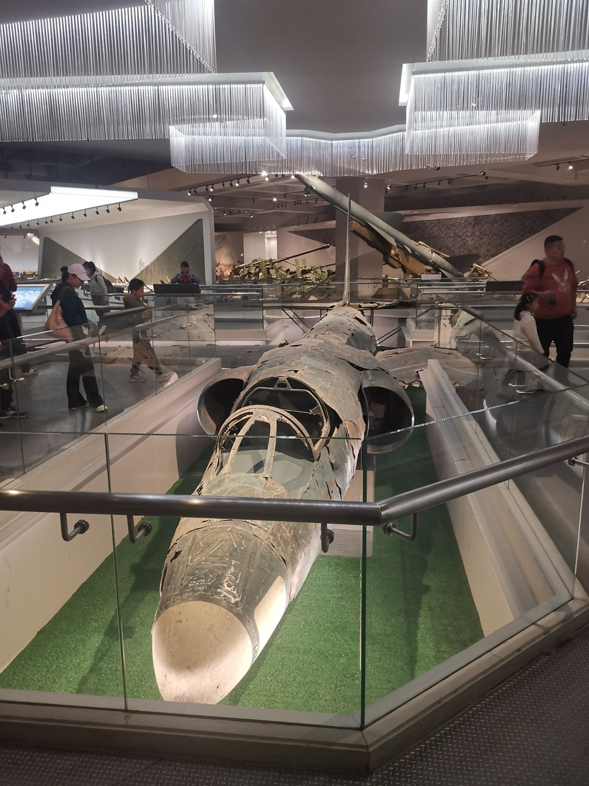
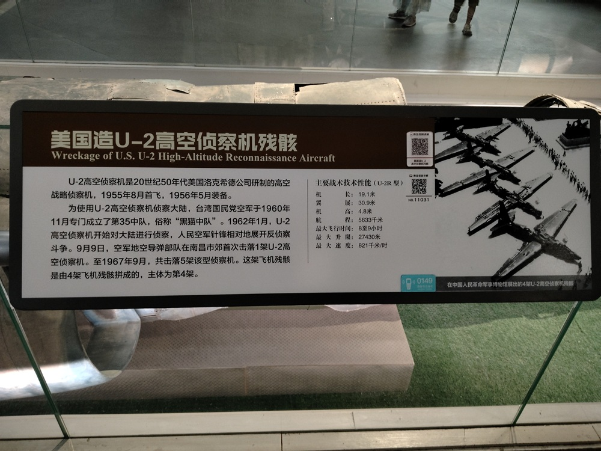

# 美国造U-2高空侦察机残骸

U-2高空侦察机是20世纪50年代美国洛克希德公司研制的高空战略侦察机，1955年8月首飞，1956年5月装备。

为使用U-2高空侦察机侦察大陆，台湾国民党空军于1960年11月专门成立了第35中队，俗称“黑猫中队”。1962年1月，U-2高空侦察机开始对大陆进行侦察，人民空军针锋相对地展开反侦察斗争。9月9日，空军地空导弹部队在南昌市郊首次击落1架U-2高空侦察机。至1967年9月，共击落5架该型侦察机。这架飞机残骸是由4架飞机残骸拼成的，主体为第4架。

主要战术技术性能：

- 机长：19.1米
- 翼展：30.9米
- 机高：4.8米
- 射程：5633米
- 最大飞行时间：8至9小时
- 最大升限：27430米
- 最大速度：821千米/时

美国U-2侦察机的设计理念，是通过极高的飞行高度，躲避地面防空武器的追击。U-2具有出色的侦察性能，还具备穿透云层和障碍物的能力，可以探测浅层地下设施。全世界只有7架U-2被击落，而其中有5架是被我空军地空导弹部队击落的。

## 两万米高空的苍蝇

U-2高空战略侦察机，是20世纪50年代美国洛克希德公司研制的，1955年8月首飞，1956年5月装备。

国民党集团1949年退守台湾，一直没有放弃反攻大陆的幻想。美国出于冷战的需要，要扩大对中国的战略侦察，于是美台双方一拍即合，开始由台湾当局出人，美国出装备，共同对大陆进行战略侦察。国民党空军于1960年11月，在台湾专门成立了第35中队，俗称黑猫中队。1962年1月，U-2高空侦察机开始对中国大陆进行侦察。

1960年代，中国的技术处于落后状态，防空力量薄弱。正值中苏关系遇冷，中国在技术和战略上，都面临着巨大的压力。

西方对中国的敌意越加明显，尤其是对中国核设施的监视、侦察，无疑是一种巨大的威胁。

U-2仗着装备技术优势，在大陆上空来去自由，轻松地获取了大量情报。就像一只讨厌的苍蝇，整天在我们头顶上嗡嗡乱飞。

## S-75防空导弹（萨姆-2地空导弹）

在抗美援朝结束后，我军开始重点关注本土防空，美台侦察机随之开始大量损失。美国人给台湾拿出了，压箱底的RB-57D高空战略侦察机。RB-57D最高飞行高度可达2万米，超过我军所有战斗机和防空武器的拦截高度。窜入大陆活动时，虽然每次都能被防空雷达发现，但是并不能将其击落。

苏联的S-75防空导弹（萨姆-2地空导弹），1953年11月开始研制，到1957年12月通过技术验收。1957年10月，中苏签订协议引进C-75防空导弹系统（国防新技术协定中使用的S-75的另一编号）。

1958年10月6日，中国空军地空导弹第1营在北京成立。12月6日，北京军区空军组建了地空导弹第2营。1959年1月18日，南京军区空军在徐州组建了地空导弹第3营。1959年4月，空军地空导弹各营赴西北靶场进行实弹打靶。1959年9月担负首都防空作战值班。

1959年10月7日，营长岳振华指挥的地空导弹第2营，在北京通县张家湾上空，击落国民党空军飞行员王英钦上尉驾驶的RB-57D侦察机。

世界防空作战史上，这是第一次使用地空导弹击落敌机。

## 导弹打游击

可能是因为RB-57D在北京被击落的原因，U-2飞机虽然在大陆横行，但从来不到北京。为了击落U-2，中央决定只留1个营保卫北京，其他4个营全部悄悄地派出去，在全国设伏。

为了配合地空导弹打游击，空军部队在1962年8月底，连续两天从南京起飞轰炸机前往南昌，造成大规模军事行动的假象。蹲守在台湾的U-2，果然按耐不住，上钩了。

在1962年9月9日早晨，一架U-2侦察机从台湾桃园机场起飞，直扑大陆纵深，目标南昌。很显然，U-2的目的就是侦察解放军轰炸机密集调动的原因。U-2万万没有想到，这是一次钓鱼执法。

根据情报战线提供的情报，U-2将在一天之内，多次飞过江西省鄱（pó）阳湖一带。当U-2侦察机，再一次飞越江西鄱阳湖上空的时候，地空导弹二营在南昌市郊将其击落，创造了中国地空导弹部队击落U-2的记录。

## 雷达科学家

在越战期间，北越大量使用S-75防空导弹（萨姆-2地空导弹）对抗美军。开始效果很好，每 2 ~ 3 枚导弹，就可有一次战果。随着战事延长，美军的科技能力与电子作战能力远超预期。到 1969 年之后，已经是每 70 枚才能有一次战果。

1962年，1架U-2侦察机被击落后，美国一片哗然。不得不对U-2紧急升级，加装雷达侦察报警系统，以感知导弹信号并发出警报。

面对U-2的升级，我军研究出了近快战法，利用其他雷达先对U-2进行照射跟踪，避免触发U-2上的报警系统。等到U-2进入导弹射程后，再突然切换为导弹信号，使得U-2难以躲避，从而又成功击落2架U-2侦察机。

1964年，U-2侦察机采取了新的对抗方式后，再度现身。雷达科学家张履谦研究发现，U-2可能已经安装了干扰系统，导致我国发射的导弹，在制导过程中发生偏移，难以准确命中目标。面对这一挑战，张履谦建议改变发射信号为连续照射信号，从而实现导弹的连续制导。我国又成功击落1架U-2侦察机，并将这项技术推向了新的高度。

后来，红旗-2号导弹研制成功。红旗2号的前身是红旗1号，红旗1号是仿制的苏联S-75防空导弹。红旗2号在外形与S-75防空导弹很相似，但有21项技术改进，性能更加先进。1967年9月8日，空军首次使用国产红旗-2号地对空导弹，在浙江嘉兴上空，击落美制U-2高空侦察机。

至此，一共击落了五架U-2侦察机，创造了世界防空史上的奇迹。

## 我们是用竹竿捅下来的

1962年9月，击落U-2的消息迅速传开后，在国内外引起了轰动。中国军方的反应迅速而低调，既没有过多的庆祝，也没有做过多的宣传。陈毅在记者会上，以一贯的幽默风格回应了外界的关注：“我们是用竹竿捅下来的。”

这句话，瞬间成为了中国外交史上的经典名句。

从1962年到1967年的5年时间里，地空导弹部队南征北战，共击落5架U-2高空战略侦察机。迄今为止，全球一共击落7架U-2，其中苏联击落1架，古巴击落1架，其余5架全部是被中国击落。中国创造了击落U-2最多的历史记录。

军博U2飞机残骸，是由4架飞机残骸拼成的，主体为第4架。